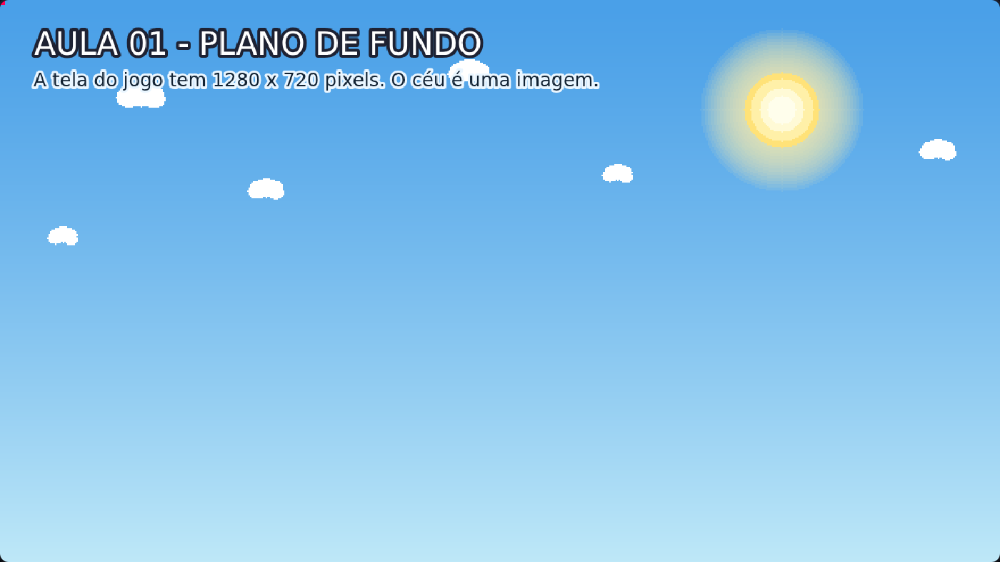

# Aula 01 — Plano de Fundo

> **Trilha:** Meu Primeiro Jogo (React + Phaser) · **Nível:** Básico · **Tempo:** ~15 min
> **Pré-requisito:** nenhum! Se você já abriu este arquivo, já pode começar.



> 📷 *Print do exemplo rodando (capturado automaticamente do jogo de verdade).*

---

## 🎯 O que você vai aprender

Colocar uma **imagem de fundo** na tela do jogo e entender os três momentos
que existem em **todo jogo feito com Phaser**:

| Momento | Nome em inglês | O que faz | Quando acontece |
|---|---|---|---|
| 1º | `preload()` | **Carrega** imagens e sons | Antes do jogo aparecer |
| 2º | `create()` | **Cria** a cena: coloca objetos na tela | Uma vez, ao começar |
| 3º | `update()` | **Atualiza**: move as coisas | ~60 vezes por segundo |

> 🧠 **Guarde isso:** "primeiro eu carrego (preload), depois eu monto (create)
> e aí eu fico atualizando (update)". Vamos usar esses três nomes em todas as aulas.

---

## 🚀 Como rodar

Você pode estudar esta aula de **duas formas**. Escolha a sua:

### Jeito 1 — Sem instalar nada (mais fácil)

1. Abra a pasta `01-Plano-de-Fundo`.
2. Dê **dois cliques** no arquivo `index.html`.
3. Pronto: o jogo abre no navegador. 🎉

> Não precisa de internet nem de instalar programas: a biblioteca do Phaser
> está na pasta `lib/` da trilha.
> Para editar o código, use qualquer editor de texto (recomendamos o
> [VS Code](https://code.visualstudio.com/), que é gratuito).

### Jeito 2 — Com React + Vite (jeito profissional)

Use este jeito se você já sabe usar o terminal, ou se o seu professor pediu.

```bash
cd 01-Plano-de-Fundo/react
npm install     # só na primeira vez (baixa o Phaser e o React)
npm run dev     # liga o "servidor de desenvolvimento"
```

Depois abra o endereço que aparecer no terminal (normalmente
`http://localhost:5173`).

> 🔎 **Qual é a diferença?** No Jeito 1, o Phaser é carregado por uma tag
> `<script>` e o jogo ocupa a página inteira. No Jeito 2, o React cuida da
> página (título, moldura, layout) e o Phaser cuida do jogo, dentro de uma
> `<div>`. O **código da aula é o mesmo** nos dois: só muda quem "liga" o jogo.

---

## 🔍 O código explicado

O arquivo importante desta aula é **`src/scenes/Jogo.js`**. Abra ele e vá
lendo junto com esta explicação:

```js
class Jogo extends Phaser.Scene {
```
Uma **cena** é como uma "tela" do jogo. Todo jogo tem pelo menos uma.
`extends Phaser.Scene` significa "minha classe é uma cena do Phaser" —
ela já vem com os superpoderes `preload`, `create` e `update`.

```js
constructor() {
    super('Jogo');
}
```
Aqui damos um **nome** para a cena: `'Jogo'`. Esse nome é usado no
`src/main.js`, que é o arquivo que liga tudo.

```js
preload() {
    this.load.image('ceu', 'assets/ceu.png');
}
```
`load.image('apelido', 'caminho')` diz ao Phaser: "pega o arquivo
`assets/ceu.png` e me devolve depois com o apelido `ceu`".
O **apelido** é um nome curto, inventado por você, para não ter que escrever
o caminho do arquivo toda vez.

```js
this.add.image(0, 0, 'ceu').setOrigin(0, 0);
```
`add.image(x, y, 'apelido')` desenha a imagem na tela.
Aqui aparece a primeira "pegadinha" do Phaser:

* O ponto **`(0, 0)`** é o **canto superior esquerdo** (e não o centro!).
* O `x` cresce para a **direita** e o `y` cresce para **baixo**.
* `setOrigin(0, 0)` faz o desenho **começar** nesse canto. Se você não usar
  `setOrigin`, o Phaser centraliza a imagem na posição indicada (era o que
  aconteceria com `(640, 360)`).

```js
this.add.text(40, 28, 'AULA 01 - PLANO DE FUNDO', { ... });
```
`add.text()` escreve na tela. As opções `stroke` e `strokeThickness` desenham
um contorno nas letras — assim o texto fica legível sobre qualquer fundo.
(Esse truque é de **UI/UX**, assunto da última aula!)

---

## 🧩 Palavras novas

| Palavra | Significado |
|---|---|
| **Phaser** | Biblioteca (um conjunto de códigos prontos) para criar jogos em JavaScript. |
| **Cena** (*scene*) | Uma "tela" do jogo: o menu, a fase 1, a tela de game over... |
| **preload / create / update** | Carregar → Criar → Atualizar. As 3 etapas de toda cena. |
| **assets** | Pasta onde ficam as imagens e sons do jogo. |
| **apelido** (*key*) | Nome curto que você dá para um arquivo, usado no código. |
| **origin** | O "ponto de encaixe" do desenho: `(0,0)` = canto, `(0.5,0.5)` = centro. |

---

## 🎯 Tarefas (faça uma de cada vez!)

1. **Troque a imagem.** No `preload()`, use `'assets/chao.png'` em vez de
   `'assets/ceu.png'`. O que apareceu?
2. **Brinque com o origin.** Troque a linha do `add.image` por:
   `this.add.image(640, 360, 'ceu').setOrigin(0.5, 0.5);` e depois por
   `this.add.image(0, 0, 'ceu').setOrigin(1, 1);`. Descreva com suas
   palavras o que mudou.
3. **Assine a obra.** Escreva seu nome no primeiro `add.text`.
4. **Troque a cor de fundo.** No arquivo `src/main.js`, troque
   `backgroundColor: '#0b1020'` por `'#2b1b45'`.
5. **Desafio:** desenhe mais uma imagem do céu na tela, menor e no canto
   de baixo à direita. Dica: use uma posição maior, como `(900, 500)`, e
   depois experimente `.setScale(0.5)` no final da linha.

---

## ❓ Problemas comuns

| Sintoma | Causa provável | Solução |
|---|---|---|
| Tela preta, sem imagem | Caminho do arquivo errado | Confira se está escrito `assets/ceu.png` (e se o arquivo existe). |
| Nada aparece no navegador | Você abriu o arquivo errado | Abra o `index.html` desta pasta, não o `src/main.js`. |
| A imagem aparece "borrada" | Arquivo pequeno esticado | Normal em imagens pequenas. Usamos `pixelArt: true` para manter o estilo. |
| Erro no console `Jogo is not defined` | A ordem dos `<script>` foi trocada | No `index.html`, o `Jogo.js` deve vir **antes** do `main.js`. |
| Nada funciona depois de editar | Erro de digitação | Abra o console (tecla **F12**) e leia a mensagem. Falta um `;`? Uma vírgula? |

> 💡 **Aprenda a usar o console do navegador (F12).** Ele mostra os erros e
> também deixa você "conversar" com o jogo. Toda pessoa que programa usa isso todos os dias.

---

## ✅ Checklist da aula

- [ ] Consigo explicar o que é `preload`, `create` e `update`.
- [ ] Sei que `(0, 0)` fica no canto superior esquerdo.
- [ ] Consigo trocar a imagem de fundo sozinho(a).
- [ ] Fiz pelo menos 3 das tarefas.

---

⬅️ **Aula anterior:** [00-Basico/01-PrimeiroScript](../../01-PrimeiroScript) · trilha original do repositório
➡️ **Próxima aula:** [02 — Chão](../02-Chao/README.md) — agora vamos construir o chão do cenário e entender o que é um *tileSprite*.
