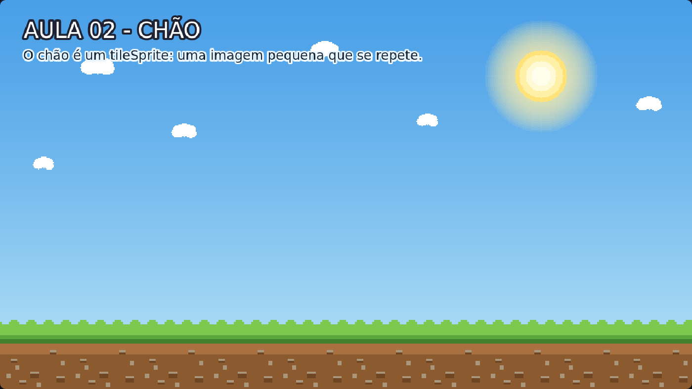

# Aula 02 — Chão

> **Trilha:** Meu Primeiro Jogo (React + Phaser) · **Nível:** Básico · **Tempo:** ~15 min
> **Pré-requisito:** [Aula 01 — Plano de Fundo](../01-Plano-de-Fundo/README.md)



> 📷 *Print do exemplo rodando (capturado automaticamente do jogo de verdade).*

---

## 🎯 O que você vai aprender

* Construir o **chão do cenário** com um **tileSprite**;
* Criar **constantes** para o código ficar fácil de ler e de mudar;
* Entender que a **ordem dos desenhos** define quem fica na frente.

> 🧠 **TileSprite** é a ferramenta que transforma uma imagem pequenina
> (nosso pedacinho de terra de 128x128) em uma área gigante, repetindo-a
> como **ladrilhos de banheiro**. Em vez de desenhar um chão de 1280 pixels,
> desenhamos um azulejo e mandamos o Phaser repeti-lo.

---

## 🚀 Como rodar

**Jeito 1 — Sem instalar nada (mais fácil)**

1. Abra esta pasta (`02-Chao`).
2. Dê **dois cliques** no arquivo `index.html`.

**Jeito 2 — Com React + Vite**

```bash
cd 02-Chao/react
npm install     # só na primeira vez
npm run dev     # abra o endereço que aparecer (geralmente http://localhost:5173)
```

> O código da aula é o mesmo nos dois formatos: `src/scenes/Jogo.js`.

---

## 🔍 O código explicado

### 1) Constantes: dando nome aos números

```js
const LARGURA_TELA = 1280;
const ALTURA_TELA = 720;
const ALTURA_CHAO = 128;   // 💡 múltiplo do tile (128, 256...) repete certinho
const TOPO_CHAO = ALTURA_TELA - ALTURA_CHAO;   // 560
const CENTRO_X = LARGURA_TELA / 2;             // 640
```

Números soltos no meio do código ("números mágicos") são um problemão.
Com constantes:

* o código **explica a si mesmo** (`TOPO_CHAO` diz mais que `560`);
* mudar o jogo fica **fácil e seguro**: mexa na constante e tudo se ajusta;
* dá para **calcular** uma constante a partir de outra, como fizemos com
  `TOPO_CHAO` e `CENTRO_X`.

### 2) O chão com tileSprite

```js
this.chao = this.add.tileSprite(CENTRO_X, TOPO_CHAO + ALTURA_CHAO / 2,
                                LARGURA_TELA, ALTURA_CHAO, 'chao');
```

Lendo em voz alta: *"posição x = centro da tela, posição y = meio da faixa
do chão, largura = tela inteira, altura = 160, imagem = 'chao'"*.

Repare que somamos `TOPO_CHAO + ALTURA_CHAO / 2`. Isso acontece porque o
Phaser posiciona objetos pelo seu **centro** (por padrão). Para que o chão
fique "grudado" embaixo da tela, calculamos a posição do meio dele.

### 3) A ordem das linhas é a ordem das camadas

```js
this.add.image(0, 0, 'ceu').setOrigin(0, 0);   // desenhado primeiro = fundo
this.chao = this.add.tileSprite(...);          // desenhado depois  = frente
```

É igual a uma pilha de papéis: **quem é colocado por último fica em cima**.
Vamos usar muito isso na próxima aula, para montar várias camadas de cenário.

---

## 🧩 Palavras novas

| Palavra | Significado |
|---|---|
| **tileSprite** | Objeto que repete (tile = ladrilho) uma imagem até preencher uma área. |
| **tile** | Cada "pedacinho" repetido. |
| **constante** | Valor com nome que não muda durante o jogo. |
| **eixo Y** | Vertical. **Cresce para BAIXO**: y=0 é o topo da tela. |
| **camada** | Ordem de desenho: o que fica atrás e o que fica na frente. |

---

## 🎯 Tarefas

As tarefas completas estão no fim de `src/scenes/Jogo.js`. As principais:

1. Mude `ALTURA_CHAO` para `60` e depois para `240`. O que muda no cenário?
2. Faça o chão escorregar uma vez: no fim do `create()`, escreva
   `this.chao.tilePositionX = 200;`.
3. Adicione `.setTileScale(2, 2)` no fim da linha do chão. Depois teste
   `(0.5, 0.5)`. Qual você prefere?
4. **Desafio:** crie um **segundo** chão mais escuro, logo abaixo do
   primeiro (posição Y maior). Ele fica na frente ou atrás? Por quê?

---

## ❓ Problemas comuns

| Sintoma | Solução |
|---|---|
| O chão "flutuou" no meio da tela | Você usou uma altura diferente do cálculo. Use `TOPO_CHAO + ALTURA_CHAO / 2` e a **mesma** altura nos dois lugares. |
| Não vejo diferença ao mudar o código | Salvou o arquivo? Recarregue com **F5**. |
| O chão ficou "esticado/borrado" | Você usou `add.image` no lugar de `add.tileSprite`. Confira a linha. |

---

## ✅ Checklist

- [ ] Sei explicar o que é um tileSprite.
- [ ] Entendi por que usamos constantes.
- [ ] Sei que a última linha desenhada fica na frente.
- [ ] Fiz pelo menos 3 tarefas.

---

⬅️ **Aula anterior:** [01 — Plano de Fundo](../01-Plano-de-Fundo/README.md)
➡️ **Próxima aula:** [03 — Cenário Completo](../03-Cenario-Completo/README.md) — camadas + **parallax**, o efeito de profundidade!
