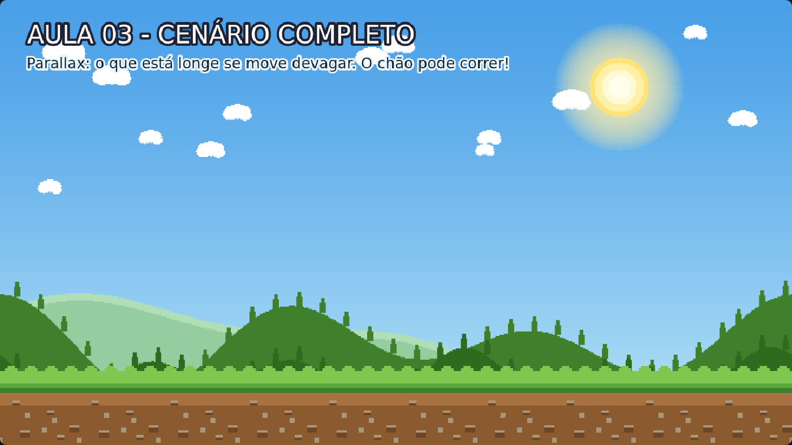

# Aula 03 — Cenário Completo

> **Trilha:** Meu Primeiro Jogo (React + Phaser) · **Nível:** Básico · **Tempo:** ~20 min
> **Pré-requisito:** [Aula 02 — Chão](../02-Chao/README.md)



> 📷 *Print do exemplo rodando (capturado automaticamente do jogo de verdade).*

---

## 🎯 O que você vai aprender

* Montar um cenário em **camadas** (como um teatro, com vários panos de fundo);
* Criar o efeito **PARALLAX** — o truque de animação mais famoso do mundo;
* Usar o `update()` pela primeira vez: o lugar onde as coisas se movem.

> 🧠 **Parallax** é a ilusão de profundidade: coisas **longe** se mexem
> **devagar**, coisas **perto** se mexem **rápido**. É assim que os desenhos
> animados, os jogos e até o mundo real funcionam! Feche um olho e olhe pela
> janela: os postes passam voando, as montanhas quase não andam. 🌄

---

## 🚀 Como rodar

**Sem instalar nada:** dê dois cliques em `index.html`.
**Com React:** `cd react && npm install && npm run dev`.

---

## 🔍 O código explicado

### 1) O cenário é um teatro com 5 camadas

```js
this.add.image(0, 0, 'ceu').setOrigin(0, 0);                                  // camada 0 (fundo)
this.montanhasClaras = this.add.tileSprite(CENTRO_X, 560, ...);               // camada 1
this.montanhas = this.add.tileSprite(CENTRO_X, 520, ...);                     // camada 2
this.nuvens = this.add.tileSprite(CENTRO_X, 150, ...);                        // camada 3
this.chao = this.add.tileSprite(CENTRO_X, TOPO_CHAO + ALTURA_CHAO / 2, ...);  // camada 4 (frente)
```

A ordem das linhas é a ordem das camadas: o céu é desenhado primeiro
(fica no fundo) e o chão por último (fica na frente). As montanhas clarinhas
vêm antes das escuras — por isso parecem mais **distantes**.

### 2) As velocidades contam a história da profundidade

```js
const VEL_NUVENS = 0.3;          // bem longe: quase parado
const VEL_MONTANHAS_CLARAS = 0.8;
const VEL_MONTANHAS = 1.6;
const VEL_CHAO = 3.5;            // bem perto: mais rápido
```

Regra de ouro: **longe = devagar, perto = rápido**. Se você inverter,
o cérebro de quem joga sente que "está errado" na hora — bom experimento!

### 3) E na hora de mexer? O update()!

```js
update() {
    this.nuvens.tilePositionX += VEL_NUVENS;
    this.montanhasClaras.tilePositionX += VEL_MONTANHAS_CLARAS;
    this.montanhas.tilePositionX += VEL_MONTANHAS;
    this.chao.tilePositionX += VEL_CHAO;
}
```

* `update()` roda **cerca de 60 vezes por segundo** (60 FPS);
* `tilePositionX` é "quanto a imagem do ladrilho está deslocada na horizontal";
* `+=` significa "some e guarde o resultado" (`x += 1` é o mesmo que `x = x + 1`).

Como isso roda 60x por segundo, o valor da velocidade é em **pixels por quadro**.
Por isso 0.3 já dá a sensação de lentidão e 3.5 de velocidade.

> 💡 **Por que o céu não se move?** Porque ele é o "infinito": nada mais
> distante existe. Também é comum (e bonito) deixar o céu parado e mover só
> as nuvens — dá a sensação de que estamos correndo sob um céu imenso.

---

## 🧩 Palavras novas

| Palavra | Significado |
|---|---|
| **camada** | Cada "pano de fundo". Desenhada em ordem, uma na frente da outra. |
| **parallax** | Efeito de profundidade: longe devagar, perto rápido. |
| **update()** | Função que roda ~60x por segundo. O lugar do movimento. |
| **FPS** | *Frames por segundo*: quantos quadros o jogo desenha por segundo. |
| **tilePositionX** | Deslocamento horizontal do ladrilho dentro de um tileSprite. |

---

## 🎯 Tarefas

1. Deixe o cenário com "cara de corrida": aumente bastante as velocidades.
2. Inverta a regra (chão lento, nuvens rápidas). Ficou estranho? Explique
   com suas palavras.
3. Apague só a linha do chão no `update()`. E depois só a das nuvens.
   Descreva a diferença.
4. **Desafio:** adicione "acelera e freia" no chão:
   ```js
   this.chao.tilePositionX += VEL_CHAO + Math.sin(Date.now() / 800) * 2;
   ```
   (`Math.sin` devolve valores entre -1 e 1, dando um movimento suave de vai-e-vem.)

> 💭 **Para pensar:** se o cenário anda para a esquerda e o personagem fica
> parado no lugar, quem está realmente se movendo? 🤔 Nunca existe resposta
> errada nessa conversa — é uma das ideias mais profundas de fazer jogos.

---

## ❓ Problemas comuns

| Sintoma | Solução |
|---|---|
| Nada se move | Você está chamando `update()`? Ele fica **dentro** da classe, depois do `create()`. |
| Uma camada tapa a outra | Ordem das linhas! A camada que deve ficar na frente precisa ser desenhada **depois**. |
| Aparece uma "emenda" andando | É normal: as imagens foram feitas para repetir perfeitamente. Se editar os PNGs, mantenha a arte longe das bordas. |

---

## ✅ Checklist

- [ ] Sei explicar o que é parallax com minhas palavras.
- [ ] Sei onde ficam os valores das velocidades.
- [ ] Entendi que o `update()` roda ~60 vezes por segundo.
- [ ] Fiz pelo menos 3 tarefas.

---

⬅️ **Aula anterior:** [02 — Chão](../02-Chao/README.md)
➡️ **Próxima aula:** [04 — Personagem](../04-Personagem/README.md) — hora de colocar o Milo no jogo! 🧍
