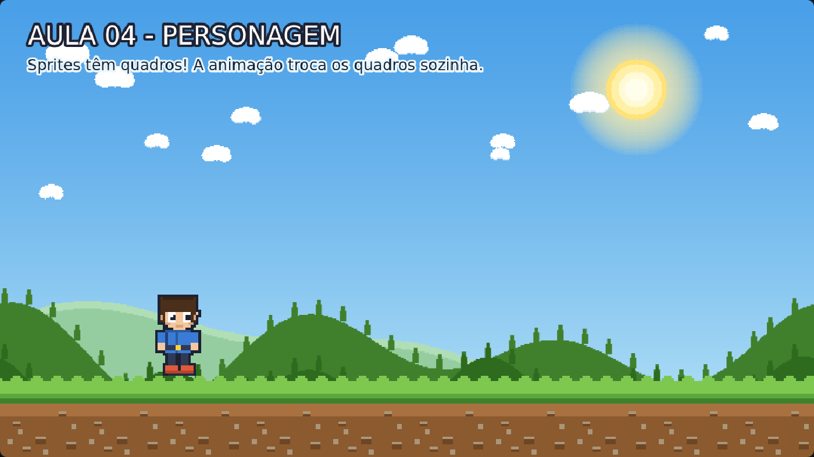

# Aula 04 — Personagem

> **Trilha:** Meu Primeiro Jogo (React + Phaser) · **Nível:** Básico · **Tempo:** ~25 min
> **Pré-requisito:** [Aula 03 — Cenário Completo](../03-Cenario-Completo/README.md)



> 📷 *Print do exemplo rodando (capturado automaticamente do jogo de verdade).*

---

## 🎯 O que você vai aprender

* Colocar o **herói (Milo)** em cima do chão;
* Entender o que é um **spritesheet** (folha de sprites);
* Criar uma **animação** de verdade e mandar o personagem executá-la;
* Aprender o truque do `setOrigin(0.5, 1)` — **pés no chão, sempre**.

---

## 🚀 Como rodar

**Sem instalar nada:** dê dois cliques em `index.html`.
**Com React:** `cd react && npm install && npm run dev`.

---

## 🔍 O código explicado

### 1) Spritesheet: uma imagem com vários desenhos

Abra `assets/heroi-parado.png` no seu computador. Você vai ver **dois
Milos** lado a lado. Cada Milo ocupa **128x128 pixels** — essa imagem larga
se chama **spritesheet** (folha de sprites).

```js
this.load.spritesheet('heroi-parado', 'assets/heroi-parado.png', {
    frameWidth: QUADRO_HEROI,   // 128
    frameHeight: QUADRO_HEROI,
});
```

O Phaser "corta" a folha em quadradinhos de 128x128 e numera cada um:
**quadro 0**, **quadro 1**, e assim por diante. Traduzindo para o mundo
real: uma folha de figurinhas recortáveis! ✂️

> 💡 **Por que não carregar cada desenho separado?** Porque em um jogo de
> verdade um personagem pode ter dezenas de quadros. Uma única folha é mais
> rápida de baixar e de desenhar — esse é o padrão profissional.

### 2) Sprite x Image

| | `add.image` | `add.sprite` |
|---|---|---|
| Desenha uma imagem | ✅ | ✅ |
| Escolhe um quadro | ❌ | ✅ |
| Toca animações | ❌ | ✅ |
| Usado para | cenário, itens | personagens, objetos animados |

### 3) A animação: quadros trocando como num flipbook

```js
this.anims.create({
    key: 'heroi-parado',                                            // nome da animação
    frames: this.anims.generateFrameNumbers('heroi-parado', { start: 0, end: 1 }),
    frameRate: 3,      // 3 quadros por segundo (a "respirada" é devagar)
    repeat: -1,        // -1 = repete para sempre (infinito)
});

this.jogador.play('heroi-parado');
```

É exatamente o que a animação faz desde o cinema mudo: **muitos desenhos
ligeiramente diferentes, trocados rápido, viram movimento**. Aqui são só
2 quadros — e olha que já dá sensação de vida!

### 4) O TRUQUE DOS PÉS NO CHÃO ⭐

```js
this.jogador = this.add.sprite(280, TOPO_CHAO, 'heroi-parado');
this.jogador.setOrigin(0.5, 1);
```

* Por padrão, o Phaser centraliza o desenho na posição: `origin = (0.5, 0.5)`.
  Com o centro em y=592, **metade do Milo ficaria enterrada** no chão!
* `setOrigin(0.5, 1)` muda o ponto de encaixe: `0.5` = meio da largura;
  `1` = **base** do desenho. Agora, colocar y=592 significa: *"a base do
  Milo fica em y=592"* — em cima da linha do chão. 🎯

> 📌 **Decore esse truque!** Ele vai aparecer em TODAS as aulas seguintes,
> e é o motivo de o personagem parecer "grudado" no chão, mesmo quando
> pulamos ou mudamos o tamanho dele.

---

## 🧩 Palavras novas

| Palavra | Significado |
|---|---|
| **sprite** | Desenho de um objeto do jogo que pode ter vários quadros. |
| **spritesheet** | Uma imagem com vários quadros lado a lado. |
| **quadro** (*frame*) | Um dos desenhos de uma animação. |
| **animação** (*animation*) | Troca automática de quadros ao longo do tempo. |
| **origin** | Ponto de encaixe do desenho (0,0 = canto; 0.5,0.5 = centro; 0.5,1 = pé). |
| **play()** | Comando que manda o sprite executar uma animação. |

---

## 🎯 Tarefas

1. Troque `frameRate: 3` por `frameRate: 30`. A respiração fica rápida ou
   devagar? Depois escolha um ritmo que você goste.
2. Troque `start: 0, end: 1` por `start: 1, end: 1`. O que acontece?
   (Dica: você "cortou" a animação para um quadro só.)
3. Mova o herói para x = 640 e depois x = 1100. Os pés continuam no chão?
   Explique.
4. Deixe o herói gigante: `.setScale(1.5)` no fim da linha do sprite.
   Os pés continuam no chão? **Por quê?** (Spoiler: é o `origin`!)
5. **Desafio:** crie uma segunda animação chamada `'sanfona'` com
   `frameRate: 12` e `repeat: 0` e mande o Milo executá-la. O que o
   `repeat: 0` faz?

---

## ❓ Problemas comuns

| Sintoma | Solução |
|---|---|
| O Milo aparece enterrado no chão | Faltou `setOrigin(0.5, 1)`. |
| O Milo está flutuando | Confira se o y é `TOPO_CHAO` (560) e não um valor menor. |
| Erro "Texture heroi-parado not found" | O caminho no `preload` precisa ser `assets/heroi-parado.png`. |
| O personagem não anima | Verifique se você chamou `.play('heroi-parado')` **depois** de criar a animação. |

---

## ✅ Checklist

- [ ] Sei o que é um spritesheet e como o Phaser o corta em quadros.
- [ ] Sei criar e executar uma animação.
- [ ] Entendi o truque do `setOrigin(0.5, 1)`.
- [ ] Sei a diferença entre `add.image` e `add.sprite`.

---

⬅️ **Aula anterior:** [03 — Cenário Completo](../03-Cenario-Completo/README.md)
➡️ **Próxima aula:** [05 — Inimigo](../05-Inimigo/README.md) — que tal alguém para atrapalhar o Milo? 🟢
