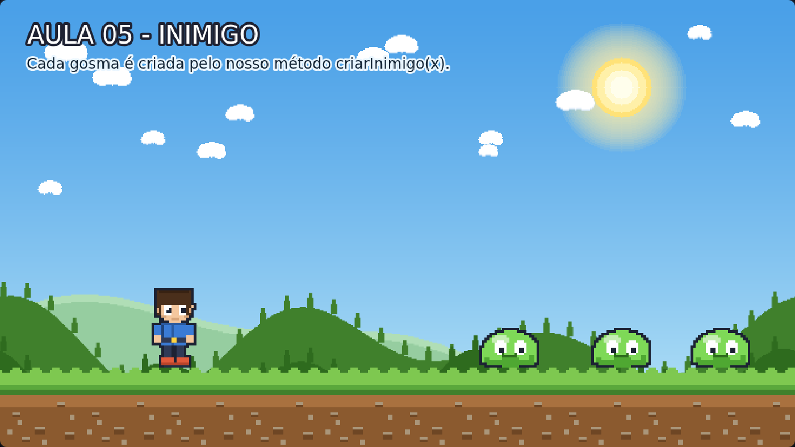

# Aula 05 — Inimigo

> **Trilha:** Meu Primeiro Jogo (React + Phaser) · **Nível:** Básico · **Tempo:** ~25 min
> **Pré-requisito:** [Aula 04 — Personagem](../04-Personagem/README.md)



> 📷 *Print do exemplo rodando (capturado automaticamente do jogo de verdade).*

---

## 🎯 O que você vai aprender

* Colocar inimigos (**gosmas**) no cenário;
* Escrever o seu primeiro **método**: uma função que "fabrica" gosmas;
* Usar uma **lista (array)** para guardar vários objetos de uma vez.

> 🧠 **Por que uma lista?** Porque você tem 3 gosmas hoje, mas talvez queira
> 50 amanhã. Com uma lista, o mesmo código serve para 3 ou para 500 inimigos.

---

## 🚀 Como rodar

**Sem instalar nada:** dê dois cliques em `index.html`.
**Com React:** `cd react && npm install && npm run dev`.

---

## 🔍 O código explicado

### 1) Um método é uma receita com nome

```js
criarInimigo(x) {
    const gosma = this.add.sprite(x, TOPO_CHAO, 'gosma-andando').setOrigin(0.5, 1);
    gosma.play('gosma-andando');
    this.inimigos.push(gosma);
    return gosma;
}
```

* **Método** = um pedaço de código com nome, que pode ser usado quantas
  vezes quisermos. Como uma receita de bolo: você escreve uma vez e assa
  quantos bolos quiser. 🍰
* Ele recebe um **parâmetro** (`x`) — a posição onde a gosma vai nascer —
  e por isso cada chamada gera uma gosma **diferente**:

```js
this.criarInimigo(820);
this.criarInimigo(1000);
this.criarInimigo(1160);
```

Sem o método, teríamos que copiar e colar 4 linhas para cada gosma.
Com ele, **1 linha por inimigo**. E se quisermos mudar algo (o tamanho, a
velocidade), mudamos em **um lugar só** — dentro da receita.

### 2) A lista de inimigos

```js
this.inimigos = [];                    // uma lista vazia
...
this.inimigos.push(gosma);             // coloca a gosma no fim da lista
console.log(this.inimigos.length);     // quantas gosmas já foram criadas
```

Uma **lista (array)** é como uma fila de escaninhos numerados: cada item
tem um lugar. `push` adiciona no fim da fila; `length` conta quantos itens
existem. Na aula 07 vamos passar por TODAS as gosmas da lista com um
`forEach` ("para cada"). A partir de agora, a lista é o nosso baú de
inimigos. 🎁

### 3) A gosma "respira" (mas ainda não anda!)

```js
this.anims.create({
    key: 'gosma-andando',
    frames: this.anims.generateFrameNumbers('gosma-andando', { start: 0, end: 3 }),
    frameRate: 6,
    repeat: -1,
});
```

O nome da animação é `gosma-andando`, mas nesta aula ela só **pula de
quadro em quadro** — a gosma está animada, porém parada no lugar.
Quem faz objeto **andar de verdade** é a **física**, que começa na próxima
aula. 😉

---

## 🧩 Palavras novas

| Palavra | Significado |
|---|---|
| **método** | Uma "receita" (função) que pertence à cena. Começa com `this.`. |
| **parâmetro** | O valor que entregamos ao método (`x`, por exemplo). |
| **lista / array** | Uma coleção ordenada de valores ou objetos. |
| **push** | Adiciona um item no fim da lista. |
| **return** | Devolve um valor para quem chamou o método. |
| **console.log()** | Escreve uma mensagem no console (F12), para você investigar. |

---

## 🎯 Tarefas

1. Adicione `this.criarInimigo(500);` no `create()`. Quantas gosmas
   aparecem? (Confirme no console, com **F12**: *"Aula 05 pronta: N gosmas"*.)
2. Troque `frameRate: 6` por `12`. A gosma fica mais assustadora ou mais
   engraçada?
3. Faça uma gosma maior: coloque `gosma.setScale(1.5);` dentro do método.
   Os pés continuam no chão? Por quê?
4. **Desafio - gosma voadora:** mude o método para `criarInimigo(x, y)` e
   crie uma gosma em `y = 300`, flutuando no ar.
5. **Para pensar:** por que usar uma lista em vez de `gosma1`, `gosma2`,
   `gosma3`...? O que aconteceria se um jogador quisesse 50 gosmas?

---

## ❓ Problemas comuns

| Sintoma | Solução |
|---|---|
| Erro `this.criarInimigo is not a function` | O método deve estar **dentro** da classe `Jogo` (entre o `create()` e o `update()`). |
| As gosmas aparecem todas no mesmo lugar | Passe valores diferentes de `x` em cada chamada. |
| A gosma "afunda" no chão | Verifique o `setOrigin(0.5, 1)` dentro do método. |
| `this.inimigos` está `undefined` | Você esqueceu de criar a lista: `this.inimigos = [];` antes de usar. |

---

## ✅ Checklist

- [ ] Sei escrever um método com parâmetro.
- [ ] Entendi para que serve uma lista e o `push`.
- [ ] Consigo criar quantos inimigos eu quiser, em uma linha cada.
- [ ] Fiz pelo menos 3 tarefas.

---

⬅️ **Aula anterior:** [04 — Personagem](../04-Personagem/README.md)
➡️ **Próxima aula:** [06 — Movimento do Personagem](../06-Movimento-do-Personagem/README.md) — **a aula mais importante da trilha!** ⭐
