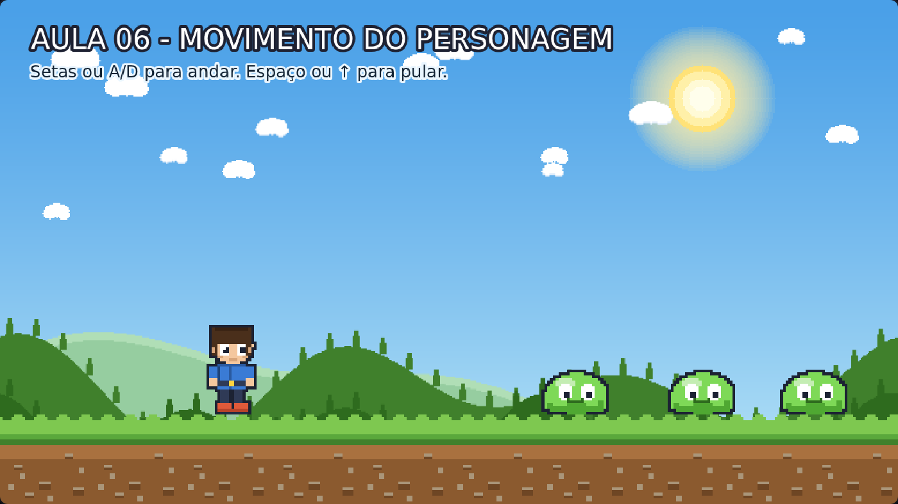

# Aula 06 — Movimento do Personagem ⭐

> **Trilha:** Meu Primeiro Jogo (React + Phaser) · **Nível:** Básico · **Tempo:** ~35 min
> **Pré-requisito:** [Aula 05 — Inimigo](../05-Inimigo/README.md)

## 🏆 Esta é a aula mais importante da trilha

Leia com calma, teste cada linha e não tenha pressa. Aqui o seu jogo
"acorda": o Milo passa a andar, pular e reagir ao teclado.



> 📷 *Print do exemplo rodando (capturado automaticamente do jogo de verdade).*

---

## 🎯 O que você vai aprender

1. O que é **FÍSICA** num jogo (e por que o chão desenhado não basta!);
2. Dar um **corpo** (body) ao personagem;
3. Ler o **teclado**;
4. **Mover** e **pular** com velocidade;
5. Escolher a **animação** certa para cada situação.

---

## 🚀 Como rodar

**Sem instalar nada:** dê dois cliques em `index.html`.
**Com React:** `cd react && npm install && npm run dev`.

**Controles:** ← → ou A/D para andar · **Espaço** ou ↑ para pular.

---

## 🔍 O código explicado

### 1) Física: o "mundo" ganha regras

Até agora, o chão era só um **desenho bonito**. A física não sabia que ele
existia! Vamos criar as regras do mundo:

```js
// Na configuração do jogo (src/main.js) já existe:
physics: {
    default: 'arcade',
    arcade: { gravity: { y: 1200 }, debug: false }   // ⬅ GRAVIDADE
},
```

* **Gravity** = a força que puxa tudo para baixo. Com `y: 1200`, qualquer
  objeto com corpo físico cai se não estiver apoiado em algo.
* 💡 **Dica de ouro:** mude `debug: false` para `debug: true` e recarregue.
  Você vai ver as **caixas de colisão** desenhadas! Use isso sempre que
  algo "estiver atravessando" outra coisa — é como um raio-X do jogo. 🩻

```js
// Dentro do create():
this.physics.world.setBounds(0, 0, LARGURA_TELA, ALTURA_TELA);
```

`setBounds` define os limites do mundo: nada escapa para fora da tela
nem cai infinitamente.

### 2) O chão físico (invisível) e o corpo do herói

```js
this.chaoFisico = this.add.rectangle(CENTRO_X, TOPO_CHAO + ALTURA_CHAO / 2,
                                     LARGURA_TELA, ALTURA_CHAO, 0x000000, 0);
this.physics.add.existing(this.chaoFisico, true);   // true = ESTÁTICO (não cai)
```

O último `0` é a **transparência**: o retângulo existe, mas ninguém vê.
Ele é um "corpo fantasma" na mesma posição do desenho do chão.

```js
this.jogador = this.add.sprite(300, TOPO_CHAO - 200, 'heroi-parado').setOrigin(0.5, 1);
this.physics.add.existing(this.jogador);            // ⬅ ganha um corpo
this.jogador.body.setCollideWorldBounds(true);      // não sai das bordas
this.jogador.body.setSize(64, 108);                 // caixa de colisão
this.jogador.body.setOffset(32, 20);                // posição da caixa no desenho
```

* `body` é o "corpo físico" do sprite: uma caixa que sofre gravidade e colide.
* `setSize` + `setOffset` ajustam essa caixa para ficar **justa** ao desenho
  (o Milo tem braços e cabelo que não deveriam "bater" nas coisas).
  Jogue com esses números depois — é divertido ver o que muda.

```js
this.physics.add.collider(this.jogador, this.chaoFisico);
```

**Sem esta linha, o Milo atravessa o chão!** `collider(A, B)` significa:
"quando A e B se tocarem, impeça a passagem".

### 3) Ler o teclado

```js
this.cursors = this.input.keyboard.createCursorKeys();
this.teclas = this.input.keyboard.addKeys({
    esq: Phaser.Input.Keyboard.KeyCodes.A,
    dir: Phaser.Input.Keyboard.KeyCodes.D,
});
```

`createCursorKeys()` cria os quatro "botões" das setas de uma vez:
`cursors.left`, `cursors.right`, `cursors.up`, `cursors.down` e também
`cursors.space`. Cada um deles tem a propriedade `.isDown`:
**`true` quando está sendo apertado, `false` quando solto.**

### 4) Mover: velocidade em X

```js
if (apertouEsquerda) {
    this.jogador.body.setVelocityX(-VEL_ANDAR);   // negativo = esquerda
    this.jogador.setFlipX(true);                  // vira o desenho
} else if (apertouDireita) {
    this.jogador.body.setVelocityX(VEL_ANDAR);
    this.jogador.setFlipX(false);
} else {
    this.jogador.body.setVelocityX(0);            // solto = para
}
```

* **Velocidade** é a quantidade de pixels que o corpo anda por segundo.
  `VEL_ANDAR = 260` = 260 pixels por segundo.
* O **sinal** indica a direção: negativo para a esquerda, positivo para a
  direita. (Só existem duas direções no eixo X — pense numa reta numérica.)
* `setFlipX(true)` **espelha** o desenho, para o Milo olhar para onde anda.
  Como a nossa arte foi desenhada olhando para a direita, viramos para a
  esquerda com `true`.

### 5) Pular

```js
const estaNoChao = this.jogador.body.blocked.down;

if (apertouPulo && estaNoChao) {
    this.jogador.body.setVelocityY(FORCA_PULO);   // -650
}
```

* `blocked.down` responde: *"tem algo me segurando por baixo?"* Se sim,
  o herói está no chão. **Só pode pular do chão!** (senão ele viraria um
  beija-flor 🐦).
* `FORCA_PULO = -650`: negativo = para **cima**. Sim, é esquisito, mas
  lembre: no Phaser o eixo Y cresce para **baixo**. Então "para cima" é
  um número negativo. Anote isso no seu caderno! ✍️
* Repare que não usamos `apertouPulo` sozinho: usamos
  `apertouPulo && estaNoChao`. O `&&` significa **E** — as duas condições
  precisam ser verdadeiras ao mesmo tempo.

### 6) Escolher a animação certa

```js
if (!estaNoChao) {
    this.jogador.anims.play('heroi-pulando', true);
} else if (apertouEsquerda || apertouDireita) {
    this.jogador.anims.play('heroi-correndo', true);
} else {
    this.jogador.anims.play('heroi-parado', true);
}
```

* A ordem importa! Primeiro testamos "não está no chão" (pulo), depois
  "está andando", e por último o caso padrão (parado). Se invertermos,
  a animação de corrida apareceria até durante o pulo.
* O `true` no fim significa *"não reinicie se já estiver tocando"*. Sem
  ele, a animação voltaria ao quadro 0 a cada quadro do jogo — o desenho
  ficaria tremendo, como um GIF que não sai do lugar.
* `||` significa **OU**: qualquer uma das duas teclas serve.

---

## 🧩 Palavras novas

| Palavra | Significado |
|---|---|
| **física** (*physics*) | O sistema que simula gravidade, velocidade e choques. |
| **body** | O "corpo físico" invisível de um objeto. |
| **gravity** | Força que puxa para baixo (eixo Y). |
| **velocity** | Velocidade: pixels por segundo, com direção (sinal). |
| **blocked.down** | "Estou apoiado em algo embaixo?" (= estou no chão) |
| **collider** | Regra que **impede** a passagem entre dois corpos. |
| **debug: true** | Mostra as caixas de colisão — seu raio-X de jogos. |

---

## 🎯 Tarefas

1. **Caixa de colisão:** ligue `debug: true` no `src/main.js` e veja as
   caixas. Agora mude `setSize(64, 108)` para `setSize(128, 128)` e
   `setOffset(0, 0)`. O Milo colide com o quê? Volte ao normal depois.
2. **Pulo mais alto/louco:** mude `FORCA_PULO` para `-350` (pulo baixinho)
   e depois para `-900` (superpulo).
3. **Velocidade:** mude `VEL_ANDAR` para `80` e depois `500`. Que números
   combinam com o seu jogo?
4. **Gravidade:** mude `gravity: { y: 1200 }` no `src/main.js` para `300`
   e depois `3000`. O que acontece com o pulo?
5. **Sempre correndo:** troque a condição de parar
   (`this.jogador.body.setVelocityX(0)`) por `-VEL_ANDAR`. Vira um jogo de
   corrida infinita!
6. **Desafio 1 - pulo variável:** cole o código do **EXTRA 1** (no fim do
   `Jogo.js`). Toque rapidinho = pulinho, segure = pulo alto.
7. **Desafio 2 - pulo duplo:** implemente o **EXTRA 2**. Todo jogo de
   plataforma moderno tem!

---

## ❓ Problemas comuns

| Sintoma | Solução |
|---|---|
| O Milo atravessa o chão e cai para sempre | Faltou o `collider` com o `chaoFisico`, ou o chão físico não é `static` (`true`). |
| Não pula de jeito nenhum | Você está testando `apertouPulo` sem `estaNoChao`? O herói precisa estar apoiado. |
| O personagem desliza para sempre | Falta o `else { setVelocityX(0) }` — o "freio" quando nenhuma tecla está apertada. |
| O herói anda "de ré" (de costas) | Inverta os valores do `setFlipX` (troque `true`/`false`). |
| A animação fica "tremendo" | Falta o `true` no `anims.play('...', true)`. |
| A caixa de colisão está deslocada | Revise `setSize` e `setOffset` (offsets são em relação ao canto do desenho). |

---

## ✅ Checklist

- [ ] Sei explicar o que é gravidade e velocidade com minhas palavras.
- [ ] Entendi por que o chão precisa de um corpo físico invisível.
- [ ] Sei que no Phaser o Y cresce para baixo (e por isso o pulo é negativo).
- [ ] Consigo mudar as três linhas que controlam o pulo (força, gravidade, condição).
- [ ] Fiz pelo menos 4 tarefas (incluindo um dos desafios!).

---

## 🎓 Para o educador(a)

* Esta aula costuma levar **2 encontros**. O primeiro para física + teclado;
  o segundo para o "cérebro" (condicionais) e as animações.
* Sugestão de **dinâmica**: escreva os três `if`s no quadro como uma
  **árvore de decisão** ("está no ar?" → pulo; "tem tecla?" → corrida;
  "senão" → parado) e peça para a turma completar as folhas.
* Os números (`VEL_ANDAR`, `FORCA_PULO`, gravidade) são o "tempero" do jogo:
  deixe a turma experimentar e descrever as sensações. Isso desenvolve
  intuição de game design — coisa que nenhum livro ensina igual.

---

⬅️ **Aula anterior:** [05 — Inimigo](../05-Inimigo/README.md)
➡️ **Próxima aula:** [07 — Movimento do Inimigo](../07-Movimento-do-Inimigo/README.md) — as gosmas vão andar sozinhas!
