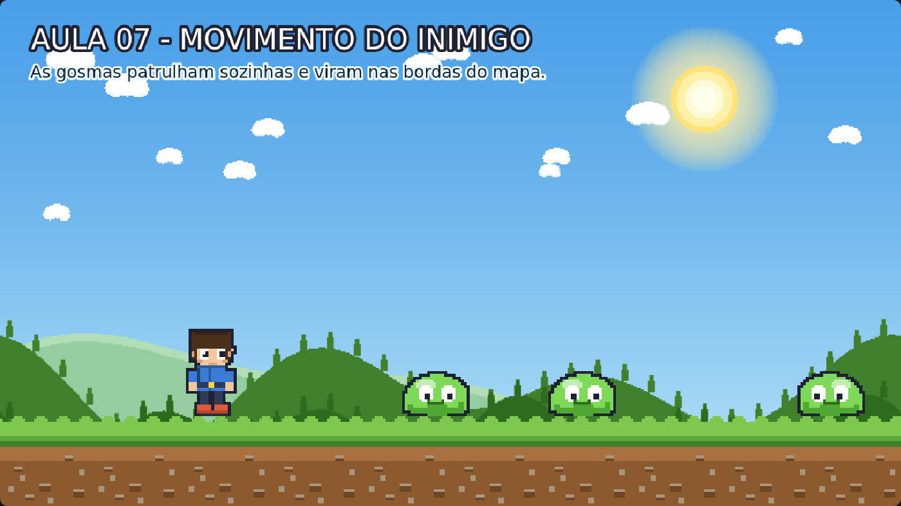

# Aula 07 — Movimento do Inimigo

> **Trilha:** Meu Primeiro Jogo (React + Phaser) · **Nível:** Básico · **Tempo:** ~30 min
> **Pré-requisito:** [Aula 06 — Movimento do Personagem](../06-Movimento-do-Personagem/README.md)



> 📷 *Print do exemplo rodando (capturado automaticamente do jogo de verdade).*

---

## 🎯 O que você vai aprender

* Dar **corpo físico e velocidade** aos inimigos;
* Usar **números aleatórios** para cada gosma ser única;
* Fazer os inimigos **virarem** ao bater nas bordas do mundo;
* Passar por **todos** os inimigos de uma lista com o `forEach`.

---

## 🚀 Como rodar

**Sem instalar nada:** dê dois cliques em `index.html`.
**Com React:** `cd react && npm install && npm run dev`.

---

## 🔍 O código explicado

### 1) Cada gosma ganha corpo e velocidade

```js
this.physics.add.existing(gosma);
gosma.body.setCollideWorldBounds(true);   // não sai do mundo (e vira nas bordas!)
gosma.body.setSize(72, 56);
gosma.body.setOffset(16, 24);
this.physics.add.collider(gosma, this.chaoFisico);
```

* `setCollideWorldBounds(true)` faz duas coisas: os inimigos não escapam
  da tela **e** o Phaser avisa quando eles batem na parede.
* A caixa de colisão (72x56) é **menor** que o desenho (104x80). Isso é
  intencional: o toque fica mais justo. Jogo justo = jogador feliz! ⚖️

### 2) Sorteio com Phaser.Math.Between

```js
const velocidade = Phaser.Math.Between(VEL_GOSMA_MIN, VEL_GOSMA_MAX);  // 60 a 130
const direcao = Math.random() < 0.5 ? -1 : 1;
gosma.body.setVelocityX(velocidade * direcao);
```

* `Phaser.Math.Between(60, 130)` devolve um número inteiro sorteado entre
  60 e 130 — cada gosma ganha **a sua** velocidade.
* `Math.random()` devolve um número entre 0 e 1 (tipo 0.37). Então
  `Math.random() < 0.5` é verdadeiro "em metade das vezes" = **50% de chance**.
* `condição ? A : B` se chama **operador ternário**: se a condição for
  verdadeira, use `A`; senão, use `B`. É um `if` de uma linha só.

> 💭 **Por que aleatoriedade é importante?** Se todas as gosmas andassem
> igual, o jogador decoraria o padrão em 10 segundos e o jogo ficaria
> chato. Pequenas variações mantêm cada partida única. (Cuidado:
> aleatoriedade demais vira injustiça! O equilíbrio é o segredo.)

### 3) Virar nas bordas

```js
this.inimigos.forEach((gosma) => {
    if (gosma.body.blocked.left) {
        gosma.body.setVelocityX(Phaser.Math.Between(VEL_GOSMA_MIN, VEL_GOSMA_MAX));
        gosma.setFlipX(false);
    } else if (gosma.body.blocked.right) {
        gosma.body.setVelocityX(-Phaser.Math.Between(VEL_GOSMA_MIN, VEL_GOSMA_MAX));
        gosma.setFlipX(true);
    }
});
```

* `forEach` = *"para cada item da lista, faça isso"*. É um jeito elegante de
  dizer "faça com TODAS as gosmas" sem escrever o código 3 vezes. 🎩
* `blocked.left` = verdadeiro quando o corpo **bateu** na borda esquerda.
  Como o mundo limite está ligado, o Phaser reinicia a velocidade para o
  outro lado — e a gosma "vira".
* Repare no sinal: bateu na **direita** → velocidade **negativa** (vai para
  a esquerda). Bateu na **esquerda** → velocidade **positiva**.

---

## 🧩 Palavras novas

| Palavra | Significado |
|---|---|
| **forEach** | Percorre todos os itens de uma lista, um por um. |
| **aleatório** | Valor sorteado (não é sempre o mesmo). |
| **Phaser.Math.Between(a, b)** | Sorteia um número inteiro entre `a` e `b`. |
| **ternário** | `condição ? A : B` — um if/else de uma linha. |
| **blocked.left/right** | "Bati na parede da esquerda/direita?" |
| **patrulhar** | Andar de um lado para o outro, sem sair do território. |

---

## 🎯 Tarefas

1. Deixe uma gosma **gigante e lenta** e outra **pequena e rápida**.
   (Dica: use `Phaser.Math.Between` também no `setScale`.)
2. Mude `VEL_GOSMA_MAX` para `300`. O jogo ficou fácil ou difícil? Por quê?
3. Faça as gosmas **quicarem**: `setBounce(1, 1)` + gravidade 800. Que loucura! 🎈
4. **Desafio — patrulha inteligente:** faça a gosma virar quando passar de
   um ponto fixo (`if (gosma.x > 1000)`).
5. **Para pensar:** como você provaria, jogando, que cada gosma tem uma
   velocidade diferente?

> 💡 **Experimente a empatia do jogador:** aumente a velocidade de todas as
> gosmas bem devagar (70, 90, 120, 160...) até que *você mesmo* erre. Onde
> está o limite do "difícil mas justo"? Isso é **balanceamento de jogo** —
> e é uma das partes mais divertidas de projetar.

---

## ❓ Problemas comuns

| Sintoma | Solução |
|---|---|
| As gosmas ficam "grudadas" na borda, tremendo | Falta o `setFlipX`/troca de velocidade: o código de virar precisa estar no `update()`. |
| Todas as gosmas andam igual | Confira se `velocidade` está sendo sorteada **dentro** do `criarInimigo`. |
| As gosmas atravessam o chão | Faltou `collider` com o `chaoFisico`. |
| A gosma anda para trás (de costas) | Inverta os valores de `setFlipX` no `update()`. |
| `this.inimigos.forEach is not a function` | `this.inimigos` não é uma lista — confira `this.inimigos = [];`. |

---

## ✅ Checklist

- [ ] Sei criar números aleatórios e entendo para que servem.
- [ ] Entendi a lógica de "bater na borda → trocar a velocidade".
- [ ] Sei o que o `forEach` faz.
- [ ] As gosmas do meu jogo patrulham e parecem "vivas".

---

⬅️ **Aula anterior:** [06 — Movimento do Personagem](../06-Movimento-do-Personagem/README.md)
➡️ **Próxima aula:** [08 — Colisão do Personagem](../08-Colisao-do-Personagem/README.md) — o que acontece quando herói e gosma se encontram? 💥
