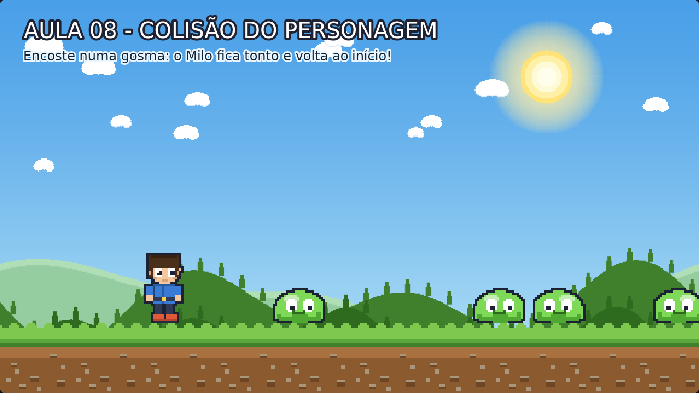

# Aula 08 — Colisão do Personagem

> **Trilha:** Meu Primeiro Jogo (React + Phaser) · **Nível:** Básico · **Tempo:** ~35 min
> **Pré-requisito:** [Aula 07 — Movimento do Inimigo](../07-Movimento-do-Inimigo/README.md)



> 📷 *Print do exemplo rodando (capturado automaticamente do jogo de verdade).*

---

## 🎯 O que você vai aprender

* A diferença entre **collider** e **overlap** (a pergunta mais frequente!);
* Detectar o toque entre herói e inimigo e **decidir o que acontece**;
* Criar **efeitos de impacto**: tremor de tela, pisca vermelho, empurrão;
* Inventar o **tempo de invencibilidade** — o truque que evita injustiça.

---

## 🚀 Como rodar

**Sem instalar nada:** dê dois cliques em `index.html`.
**Com React:** `cd react && npm install && npm run dev`.

Encoste numa gosma para ver o que acontece! 👀

---

## 🔍 O código explicado

### 1) COLLIDER x OVERLAP — anote este quadro no caderno

| | `collider` | `overlap` |
|---|---|---|
| **Impede** a passagem? | ✅ Sim | ❌ Não |
| **Avisa** quando se tocam? | ✅ Sim | ✅ Sim |
| Use quando... | o chão segura o herói; a parede bloqueia | uma moeda é coletada; um inimigo dá dano |
| Exemplos no nosso jogo | herói × chão, gosma × chão | herói × gosma, herói × moeda |

```js
this.physics.add.overlap(this.jogador, this.inimigos, this.levarDano, null, this);
```

Lendo em voz alta: *"quando o jogador encostar em qualquer um da **lista**
de inimigos, chame a função `levarDano`"*.

* Não é o nosso código que chama a função — **o Phaser chama** para nós,
  cada quadro em que houver toque. Isso se chama **callback** (função de
  retorno).
* O último `this` diz qual é o "eu" dentro da função. Sem ele, o `this`
  lá dentro não será a cena — e nada vai funcionar. É uma pegadinha
  clássica! ⚠️

### 2) A função de dano

```js
levarDano(jogador, inimigo) {
    if (this.invencivel) return;      // já estou invencível? então ignoro
    this.invencivel = true;
    ...
}
```

* `return` **sai da função na hora**. É o nosso "não faz mais nada aqui".
* Por que precisamos disso? Porque o `overlap` avisa **60 vezes por
  segundo** enquanto estiverem encostados! Sem a proteção, o herói levaria
  60 danos por segundo. A variável `invencivel` é uma **trava**.

### 3) Efeitos de impacto (o "suco" do jogo 🍋)

```js
this.cameras.main.shake(180, 0.008);    // tela treme por 180 ms
this.jogador.setTint(0xff6b6b);         // pinta o herói de vermelho
this.time.delayedCall(300, () => this.jogador.clearTint());
```

* `shake(duração, intensidade)` = tremor de câmera. É o efeito mais
  "gostoso" de acertar/esbarrar — usado em todos os consoles desde os anos 80.
* `setTint` **tinge** o desenho; `clearTint` volta ao normal.
* `this.time.delayedCall(300, função)` = *"espere 300 milissegundos e
  depois faça isso"*. É um **timer** — não trava o jogo enquanto espera.
* Empurrão (knockback): `setVelocityX(220 * direcao)` joga o herói para o
  lado contrário ao inimigo; `setVelocityY(-380)` dá um "soltinho" para cima.

> 💡 **Detalhe de UX:** juntando tremor + cor + empurrão, o jogador
> **entende** que "levou dano" sem nenhum texto explicando. Isso é o que os
> profissionais chamam de *game feel* — a sensação de jogar. Costuma ser a
> diferença entre um jogo "seco" e um jogo gostoso.

---

## 🧩 Palavras novas

| Palavra | Significado |
|---|---|
| **overlap** | Detecta o toque sem impedir a passagem. |
| **callback** | Função que o Phaser chama quando algo acontece. |
| **return** | Sai da função imediatamente. |
| **timer / delayedCall** | Executa algo depois de um tempo, sem travar o jogo. |
| **shake / flash / tint** | Efeitos de impacto: tremer, piscar, tingir. |
| **invencibilidade** | Tempo em que o herói não pode levar dano de novo. |
| **game feel** | As sensações físicas de jogar (impacto, resposta, peso). |

---

## 🎯 Tarefas

1. Deixe o dano mais forte: empurrão `400` e `-700`. O que muda no jogo?
2. **Tire** o tempo de invencibilidade (comente `this.invencivel = true;`
   com `//`). Jogue e sinta o caos! Depois descomente.
3. Mude o tremor: `shake(180, 0.008)` → `shake(500, 0.02)`. Muito exagerado?
   Ache o seu valor favorito.
4. Troque a cor do pisca: `0x0000ff` (azul) e `0x00ff00` (verde).
5. **Desafio:** mostre as vidas com `console.log('Vida perdida!')` dentro
   do `levarDano`. (O HUD de verdade vem na aula 12!)
6. **Para pensar:** escreva com suas palavras quando usar `collider` e
   quando usar `overlap`. Depois explique para alguém.

---

## ❓ Problemas comuns

| Sintoma | Solução |
|---|---|
| O dano acontece várias vezes seguidas | Falta a trava `if (this.invencivel) return;`. |
| Erro `this.invencivel is undefined` | Crie a variável no `create()`: `this.invencivel = false;`. |
| A função de dano não é chamada | Confira a linha do `overlap` (e o `this` no final!). |
| O herói continua piscando vermelho para sempre | Faltou o `clearTint()` no `delayedCall`. |
| O herói fica preso no inimigo | Normal: o `overlap` não empurra. Por isso usamos o knockback manual. |

---

## ✅ Checklist

- [ ] Sei a diferença entre `collider` e `overlap`.
- [ ] Entendi o que é uma função de callback.
- [ ] Sei por que precisamos do tempo de invencibilidade.
- [ ] Meu jogo tem algum efeito de impacto (tremor, flash ou pisca).
- [ ] Fiz pelo menos 3 tarefas.

---

⬅️ **Aula anterior:** [07 — Movimento do Inimigo](../07-Movimento-do-Inimigo/README.md)
➡️ **Próxima aula:** [09 — Colisão do Inimigo](../09-Colisao-do-Inimigo/README.md) — o momento mais gostoso: **pular em cima da gosma!** 🦶
