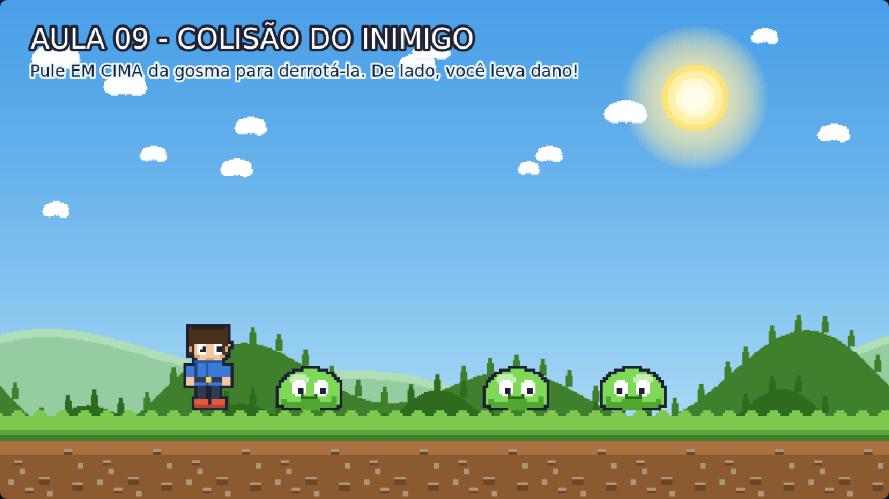

# Aula 09 — Colisão do Inimigo (O Pisão!)

> **Trilha:** Meu Primeiro Jogo (React + Phaser) · **Nível:** Básico · **Tempo:** ~40 min
> **Pré-requisito:** [Aula 08 — Colisão do Personagem](../08-Colisao-do-Personagem/README.md)



> 📷 *Print do exemplo rodando (capturado automaticamente do jogo de verdade).*

---

## 🎯 O que você vai aprender

* O clássico **pisão** dos jogos de plataforma (como no Mario!);
* Tomar **decisões** dentro de um overlap, comparando direções e posições;
* Remover objetos do jogo com `destroy()`;
* Deixar o jogo **satisfatório**: tela piscando, quique de comemoração.

---

## 🚀 Como rodar

**Sem instalar nada:** dê dois cliques em `index.html`.
**Com React:** `cd react && npm install && npm run dev`.

**Como jogar:** pule **em cima** da gosma para derrotá-la. Encostar de lado = dano!

---

## 🔍 O código explicado

### 1) A decisão mais importante do jogo ⚖️

```js
aoTocarInimigo(jogador, inimigo) {
    if (inimigo.derrotada) return;

    const estaCaindo = jogador.body.velocity.y > 0;
    const peAbaixoDoTopo = jogador.body.bottom <= inimigo.body.top + 24;

    if (estaCaindo && peAbaixoDoTopo) {
        this.derrotarInimigo(inimigo, jogador);   // 🏆 pisão!
    } else {
        this.levarDano(jogador, inimigo);         // 💥 dano!
    }
}
```

A pergunta é: **"o herói está caindo E os pés estão na parte de cima da gosma?"**

* `velocity.y > 0` → a velocidade vertical é **positiva**, ou seja, o corpo
  está indo para **baixo**. No Phaser: Y cresce para baixo, então "caindo"
  é positivo. (Contrário do pulo, que é negativo. Sim, temos que pensar um
  pouco — e é exatamente por isso que programar é divertido! 🧠)
* `jogador.body.bottom` = a parte de baixo da caixa do herói (os pés).
* `inimigo.body.top` = a parte de cima da caixa da gosma (a cabeça dela).
* O `+ 24` é uma **margem de tolerância**: sem ela, o pisão só funcionaria
  no pixel exato — o que seria quase impossível. Jogos são feitos de
  tolerâncias generosas! 💛

> 💭 **Pense:** se testássemos **só** `estaCaindo`, o que daria errado?
> (Dica: pulando para o lado, batendo na gosma já em queda, o herói
> "ganharia" do inimigo. As duas condições juntas são o que torna o pisão
> justo.)

### 2) Derrotar: a recompensa

```js
inimigo.derrotada = true;                       // marca: já era
inimigo.body.enable = false;                    // desliga a colisão dela
inimigo.anims.play('gosma-derrotada', true);    // a poça que desaparece
jogador.body.setVelocityY(FORCA_QUIQUE);        // herói quica para cima
this.cameras.main.flash(120, 255, 255, 255);    // piscada branca
```

* `body.enable = false` **desliga** o corpo físico: a gosma derrotada para
  de empurrar/colidir, mas continua na tela até a animação terminar.
* Por que o quique (`FORCA_QUIQUE = -420`)? Porque sem ele o herói cai
  direto na gosma derrotada e a sensação é "dura". O quique dá **leveza** —
  é assim que todo jogo de plataforma clássico faz.
* `flash(duração, r, g, b)`: a tela pisca na cor escolhida. Use com
  moderação! Efeitos demais cansam os olhos.

### 3) Remover a gosma para sempre

```js
inimigo.once('animationcomplete', () => {
    inimigo.destroy();
});
```

* `once` = *"escute este evento UMA vez"*. Quando a animação terminar, a
  gosma é removida do jogo com `destroy()` — liberando memória.
* Sem isso, gosmas "fantasmas" continuariam existindo (invisíveis ou não)
  e o jogo ficaria mais pesado aos poucos.
* A flag `derrotada` também protege: no `update()`, gosmas derrotadas são
  ignoradas (`if (!gosma.active || gosma.derrotada) return;`).

---

## 🧩 Palavras novas

| Palavra | Significado |
|---|---|
| **pisão** | Derrotar o inimigo caindo em cima dele. |
| **flag** | Uma variável que marca um estado (`derrotada = true`). |
| **body.enable** | Liga/desliga o corpo físico de um objeto. |
| **destroy()** | Remove o objeto do jogo definitivamente. |
| **once** | Escuta um evento apenas uma vez. |
| **tolerância** | Margem que torna a jogabilidade justa (o `+ 24`). |

---

## 🎯 Tarefas

1. Deixe o pisão mais **generoso**: troque `+ 24` por `+ 50`. Ficou fácil?
   Menos justo?
2. Deixe o pisão mais **difícil**: troque por `+ 0`. Use `debug: true` para
   ver as caixas e entender a dificuldade.
3. Troque o flash por um tremor: `shake(120, 0.01)`.
4. Faça a gosma derrotada sumir mais rápido: `frameRate` da animação
   `gosma-derrotada` de `8` para `20`.
5. **Desafio 1:** quique mais alto (`FORCA_QUIQUE = -600`) para comemorar!
6. **Desafio 2 — pontos!** Crie `this.pontos = 0` no `create()`, faça
   `this.pontos += 100` no `derrotarInimigo` e mostre no console
   (`console.log`). Na aula 12 isso vira HUD de verdade!

---

## ❓ Problemas comuns

| Sintoma | Solução |
|---|---|
| Todo toque dá dano (nunca derrota) | Confira se `estaCaindo` está sendo testado (`velocity.y > 0`). |
| O pisão não funciona nunca | Talvez a margem esteja muito pequena (`+ 0`). Ou o herói não está caindo de verdade na hora do toque. |
| A gosma derrotada continua dando dano | Faltou `inimigo.body.enable = false` (ou a flag `derrotada`). |
| A gosma derrotada fica na tela para sempre | Faltou o `once('animationcomplete', ... destroy())`. |
| O console dá erro `inimigo.destroy is not a function` | Você está chamando `destroy` na lista em vez do objeto. |

---

## ✅ Checklist

- [ ] Entendi as duas condições do pisão (caindo + pés acima).
- [ ] Sei usar uma flag (`derrotada`) para marcar estado.
- [ ] Sei remover objetos com `destroy()`.
- [ ] Meu jogo dá aquela sensação gostosa de vencer o inimigo. 😄

---

⬅️ **Aula anterior:** [08 — Colisão do Personagem](../08-Colisao-do-Personagem/README.md)
➡️ **Próxima aula:** [10 — Objetos em Tela](../10-Objetos-em-Tela/README.md) — moedas girando e voando! 🪙
