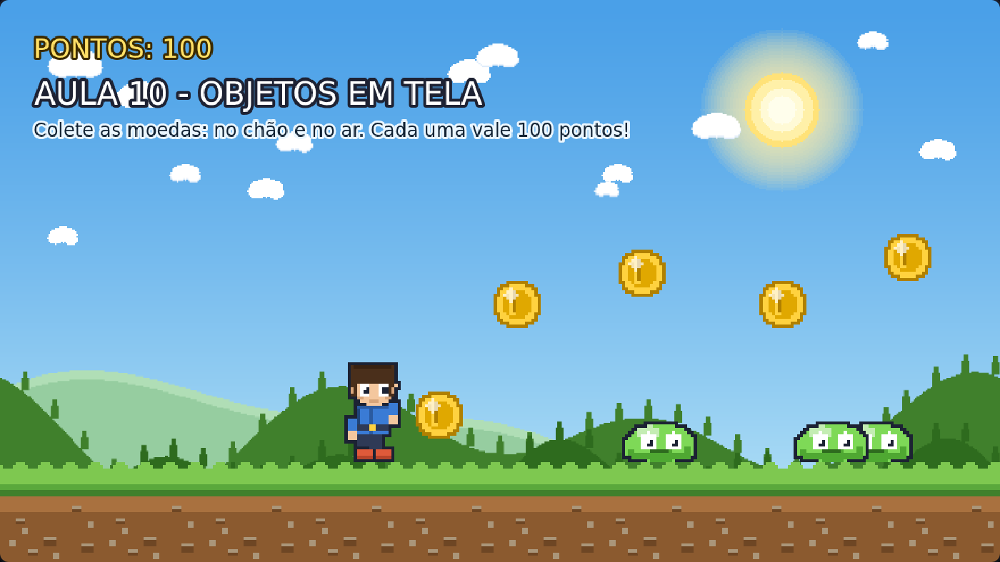

# Aula 10 — Objetos em Tela (Moedas e Coletáveis)

> **Trilha:** Meu Primeiro Jogo (React + Phaser) · **Nível:** Básico · **Tempo:** ~40 min
> **Pré-requisito:** [Aula 09 — Colisão do Inimigo](../09-Colisao-do-Inimigo/README.md)



> 📷 *Print do exemplo rodando (capturado automaticamente do jogo de verdade).*

---

## 🎯 O que você vai aprender

* Colocar **itens** (moedas) no cenário;
* Fazer objetos **flutuarem** com tweens;
* Coletar itens que **somem** com estilo (+100 voando pra cima!);
* Guardar e mostrar a **pontuação** — o comecinho do HUD.

---

## 🚀 Como rodar

**Sem instalar nada:** dê dois cliques em `index.html`.
**Com React:** `cd react && npm install && npm run dev`.

Pegue as moedas do chão **e** as do ar (pule!).

---

## 🔍 O código explicado

### 1) TWEEN: a animação de verdade, sem quadro a quadro

```js
this.tweens.add({
    targets: moeda,
    y: y - 14,            // vai para 14 pixels acima...
    duration: 700,        // ...em 700 milissegundos
    ease: 'Sine.inOut',   // suave no começo e no fim
    yoyo: true,           // e volta!
    repeat: -1,           // para sempre
});
```

* **Tween** = interpolação: *"leve o objeto do ponto A ao ponto B
  suavemente"*. É o jeito fácil de fazer flutuar, crescer, girar, aparecer
  e desaparecer.
* Em vez de desenhar vários quadros (como no spritesheet), o Phaser
  **calcula** posições intermediárias — e o resultado parece igualmente vivo.
* `yoyo: true` faz ida e volta; `repeat: -1` repete infinitamente. Juntos,
  dão o famoso "objeto boiando" — você já viu isso em mil jogos. 🎈
* `ease` (suavização) controla a aceleração. Experimente `'Linear'`,
  `'Bounce.out'` (quica!) e `'Back.out'`.

### 2) O SEGREDO IMPORTANTE: corpo dinâmico, não estático ⚠️

```js
this.physics.add.existing(moeda);
moeda.body.setAllowGravity(false);   // não cai
moeda.body.setImmovable(true);       // ninguém empurra
```

Se você usasse um corpo **estático** (como o chão), a caixa de colisão
**ficaria para trás** quando a moeda se movesse no tween! Você veria a
moeda flutuando no ar e o toque funcionando no lugar **onde ela estava**.

Por isso a moeda usa corpo **dinâmico** sem gravidade: a caixa acompanha a
moeda em todos os quadros. 🔍
*(Esse é um dos erros mais comuns no Phaser — se um item "não é coletado
onde deveria", revise isso.)*

### 3) Coletar com estilo

```js
coletarMoeda(jogador, moeda) {
    if (!moeda.active) return;        // já coletada? ignora
    moeda.body.enable = false;        // não pode ser coletada 2x

    this.tweens.add({
        targets: moeda, scale: 1.8, alpha: 0, duration: 220,
        onComplete: () => moeda.destroy(),
    });
    ...
    this.pontos += PONTOS_MOEDA;
    this.textoPontos.setText('PONTOS: ' + this.pontos);
}
```

* `alpha` é a **transparência** (0 = invisível, 1 = opaco). A moeda cresce
  e desaparece — feedback claro de "foi coletada!".
* `setText()` atualiza o texto na tela. Repare: usamos a mesma variável
  `this.textoPontos` para escrever o novo valor.
* `'+' + PONTOS_MOEDA` junta (concatena) texto e número — o Phaser precisa
  receber uma **string**.

### 4) O "+100" que voa (juice! 🍋)

```js
const textoBonus = this.add.text(moeda.x, moeda.y - 30, '+100', {...}).setOrigin(0.5);
this.tweens.add({ targets: textoBonus, y: textoBonus.y - 60, alpha: 0, duration: 600,
                  onComplete: () => textoBonus.destroy() });
```

Esse detalhe parece bobagem, mas **muda tudo** na sensação do jogo. Os
desenvolvedores chamam esses exageros gostosos de *juice* (suco) ou
*game feel*. Sempre que der, dê um feedback visual para cada ação do
jogador: ele merece saber que acertou! ✨

---

## 🧩 Palavras novas

| Palavra | Significado |
|---|---|
| **tween** | Animação calculada entre dois valores (A → B). |
| **ease** | Suavização do tween (como ele acelera/desacelera). |
| **yoyo** | Tween que vai e volta. |
| **alpha** | Transparência (0 a 1). |
| **collectable** | Item coletável (moeda, fruta, estrela, poção...). |
| **juice / game feel** | Exageros de feedback que deixam o jogo gostoso. |
| **setText()** | Trocar o texto mostrado na tela. |

---

## 🎯 Tarefas

1. Coloque uma moeda "impossível" (`x: 1240, y: 80`). É bom ter itens
   inalcançáveis num jogo? (Conversa de *level design*! 🗺️)
2. Mude `PONTOS_MOEDA` para `1000`. O jogo ficou mais empolgante?
3. Deixe a flutuação mais rápida: `duration: 700` → `250`.
4. Estenda o método: `criarMoeda(x, y, valor)` — uma moeda **azul** que
   vale o dobro. (Você pode carregar outra imagem ou usar `.setTint(0x66ccff)`.)
5. **Desafio:** crie um item que se move pela tela usando tween em `x`
   (de um lado para o outro). Depois conte: foi fácil errar? Por quê?
6. **Para pensar:** por que a moeda usa corpo dinâmico sem gravidade, e
   não corpo estático?

---

## ❓ Problemas comuns

| Sintoma | Solução |
|---|---|
| A moeda flutua, mas não é coletada | Corpo estático! Use dinâmico + `setAllowGravity(false)`. |
| A moeda cai para o chão | Falta `setAllowGravity(false)`. |
| Os pontos contam várias vezes | Falta o `if (!moeda.active) return;` ou `body.enable = false`. |
| Os textos com "+100" ficam na tela | Falta o `onComplete: () => textoBonus.destroy()`. |
| `this.moedas.push` dá erro | Você criou `this.moedas = [];` antes de chamar `criarMoeda`? |

---

## ✅ Checklist

- [ ] Sei criar tweens (e entendi `yoyo`, `duration`, `ease`).
- [ ] Entendi o segredo do corpo dinâmico sem gravidade.
- [ ] Meu jogo tem coletáveis com feedback visual.
- [ ] A pontuação aparece e atualiza na tela.

---

⬅️ **Aula anterior:** [09 — Colisão do Inimigo](../09-Colisao-do-Inimigo/README.md)
➡️ **Próxima aula:** [11 — Novas Plataformas](../11-Novas-Plataformas/README.md) — escadas para o céu, com uma estrela esperando! ⭐
