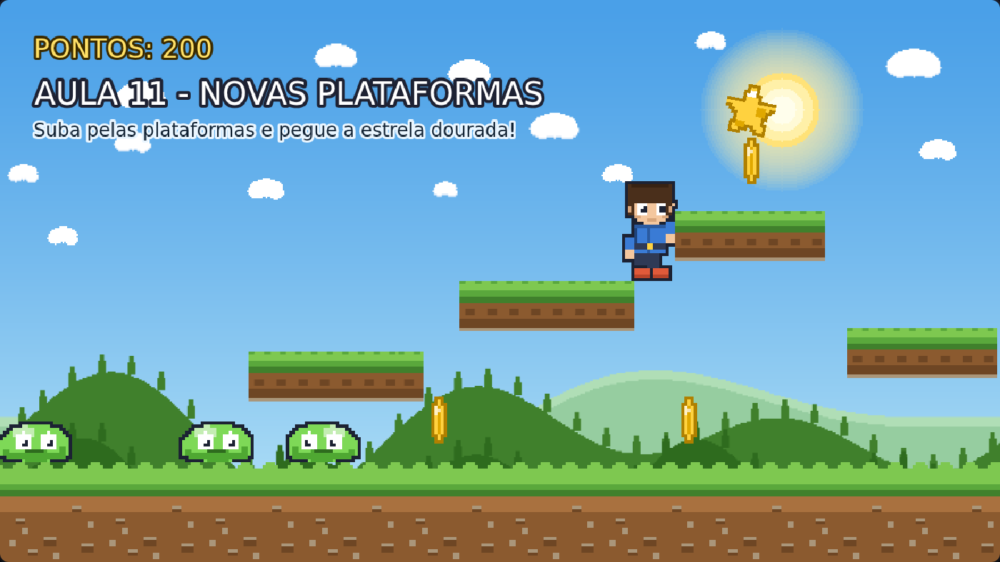

# Aula 11 — Novas Plataformas

> **Trilha:** Meu Primeiro Jogo (React + Phaser) · **Nível:** Básico · **Tempo:** ~45 min
> **Pré-requisito:** [Aula 10 — Objetos em Tela](../10-Objetos-em-Tela/README.md)



> 📷 *Print do exemplo rodando (capturado automaticamente do jogo de verdade).*

---

## 🎯 O que você vai aprender

* Criar **plataformas** por onde o herói pode pular e subir;
* Entender que todo objeto jogável tem **um desenho + um corpo físico**;
* Criar uma **escadinha** no céu que leva ao prêmio do nível;
* Fazer o item final: a **estrela dourada**. 🏆

---

## 🚀 Como rodar

**Sem instalar nada:** dê dois cliques em `index.html`.
**Com React:** `cd react && npm install && npm run dev`.

**Missão:** suba pelas plataformas de baixo para cima e pegue a estrela!

---

## 🔍 O código explicado

### 1) Uma plataforma são DUAS coisas

```js
criarPlataforma(centroX, topoY, largura) {
    const altura = 64;

    // 1) O DESENHO (o que o jogador vê)
    this.add.tileSprite(centroX, topoY + altura / 2, largura, altura, 'plataforma');

    // 2) O CORPO FÍSICO (a caixa invisível em que o herói pisa)
    const corpo = this.add.rectangle(centroX, topoY + altura / 2, largura, altura, 0x000000, 0);
    this.physics.add.existing(corpo, true);        // true = estático: não cai!
    this.physics.add.collider(this.jogador, corpo);

    return corpo;
}
```

Essa separação (desenho × corpo) já apareceu no chão da aula 06 — e agora
fica clara: **o jogador interage com corpos, não com desenhos**.
Como usamos `tileSprite` no desenho, a plataforma pode ter **qualquer
largura**: o pedacinho de terra de 192 pixels se repete até preencher.

* Recebemos o `topoY` (a superfície, onde o pé pisa) e calculamos o centro
  somando meia altura. Fica muito mais natural posicionar as plataformas
  pensando na "linha de cima".
* `return corpo` devolve a plataforma criada — quem chamou pode guardá-la
  se quiser mexer depois (mover, crescer, piscar...).

### 2) Construindo a escadinha

```js
this.criarPlataforma(430, 450, 224);    // (centroX, topoY, largura)
this.criarPlataforma(700, 360, 224);
this.criarPlataforma(960, 270, 192);
this.criarPlataforma(1180, 420, 192);
```

Lendo a segunda linha: *"uma plataforma com centro em x=430, cujo topo fica
na altura 450, com 224 pixels de largura"*.

> 💡 **Pense como designer:** o topo de cada plataforma está **90 pixels**
> acima da anterior. Descobrimos esse número **testando**: se a altura fosse
> maior que o alcance do pulo, o nível ficaria impossível. Esse tipo de
> ajuste se chama **level design baseado no alcance do jogador** — é assim
> que os profissionais fazem. 🎮

### 3) A estrela dourada (o prêmio)

```js
this.tweens.add({ targets: estrela, angle: 12, duration: 900, ... yoyo: true, repeat: -1 });
this.tweens.add({ targets: estrela, y: y - 10, duration: 800, ... });
```

* Dois tweens juntos: **girar de leve** (`angle`) e **flutuar** (`y`).
  Movimentos levemente diferentes dão um ar "mágico" — se fossem iguais,
  pareceria mecânico.
* Ao pegar a estrela, o jogo comemora: tela pisca em dourado, texto gigante
  de vitória (que sobe e some) e a estrela voa girando para o céu.

### 4) `setImmovable` nos itens

```js
estrela.body.setAllowGravity(false);
estrela.body.setImmovable(true);
```

`setImmovable(true)` = "nada empurra este objeto". Sem isso, o herói
esbarraria na estrela como se fosse uma parede. Com o corpo imóvel, a
estrela é atravessável e só o `overlap` a detecta. Perfeito para itens. ✨

---

## 🧩 Palavras novas

| Palavra | Significado |
|---|---|
| **plataforma** | Superfície em que o personagem pode pular e ficar em cima. |
| **nível** (*level*) | Um "mapa" do jogo, com seus obstáculos e objetivos. |
| **level design** | A arte de desenhar os níveis (desafio justo, caminhos, segredos). |
| **setImmovable** | Deixa o corpo "fixo": ninguém empurra. |
| **angle** | Rotação do sprite, em graus. |
| **objetivo** | O que o jogador precisa fazer para vencer a fase. |

---

## 🎯 Tarefas

1. Deixe o pulo mais alto (`FORCA_PULO = -780`) e tente chegar na estrela
   **sem** usar as plataformas do meio. Dá? Foi divertido ou "quebrou" o
   desafio?
2. Crie uma plataforma nova: `this.criarPlataforma(200, 300, 192);`.
   Dá para subir nela? De onde?
3. Coloque uma moeda em cima da estrela. Qual é pego primeiro? Por quê?
4. Troque a estrela por uma moeda (`'moeda'`) e personalize a mensagem de
   vitória.
5. **Desafio — plataforma fantasma:** dentro do `criarPlataforma`, faça um
   tween de `alpha` (1 → 0.4) no **desenho**. O corpo continua lá, então o
   jogador "pisa no ar"! Isso é bom ou ruim? Como avisar o jogador?
6. **Para pensar:** por que usamos `topoY` (superfície) em vez do centro
   para posicionar as plataformas? Como você explicaria isso?

---

## ❓ Problemas comuns

| Sintoma | Solução |
|---|---|
| Atravesso a plataforma | Falta o `collider`. Ou você criou só o desenho e esqueceu o corpo! |
| O herói fica "vibrando" em cima da plataforma | O corpo dela pode estar sobrepondo o do chão. Ajuste a altura (topoY). |
| A plataforma caiu | Você não passou `true` no `physics.add.existing(corpo, true)`. |
| A plataforma é curta/larga demais | É o parâmetro `largura` no `criarPlataforma`. |
| A estrela "empurra" o herói | Falta `setImmovable(true)`. |

---

## ✅ Checklist

- [ ] Sei criar uma plataforma (desenho + corpo) e explicar por que são dois objetos.
- [ ] Entendi que o nível deve ser desenhado respeitando o alcance do pulo.
- [ ] Meu jogo tem um objetivo claro (a estrela!).
- [ ] Fiz pelo menos 3 tarefas.

---

⬅️ **Aula anterior:** [10 — Objetos em Tela](../10-Objetos-em-Tela/README.md)
➡️ **Próxima aula e última!** [12 — HUD / UI-UX](../12-HUD-UI-UX/README.md) — vidas, game over e a cara final do jogo. 🎨
