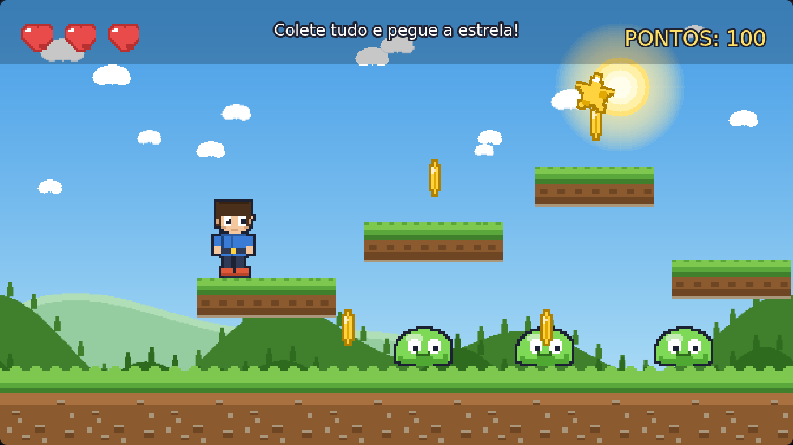

# 🎮 Meu Primeiro Jogo — Trilha para iniciantes (8 a 16 anos)

> **Do zero ao jogo de plataforma completo, em 12 aulas.**
> Trilha didática do projeto [React + Phaser](../../../README.md), em português,
> pensada para **crianças a partir de 8 anos, adolescentes e quem nunca programou**.

Todas as imagens desta trilha (personagem, inimigos, cenário) foram criadas
especialmente para ela e podem ser usadas livremente (licença MIT, igual à
do repositório).

---

## 🎯 O que você vai construir

Começamos com **uma imagem de céu** e terminamos com um **jogo de plataforma
de verdade**: herói animado que anda e pula, inimigos que patrulham, pisão,
moedas, plataformas, estrela de bônus, vidas, HUD e tela de game over.

| | |
|---|---|
|  |  |
| **Aula 03** — cenário em camadas com parallax | **Aula 12** — HUD, vidas e game over |

---

## 📚 As 12 aulas

| # | Aula | Você aprende | Tempo |
|---|---|---|---|
| 01 | [Plano de Fundo](01-Plano-de-Fundo/README.md) | `preload` / `create` / `update`, posicionamento (0,0) | 15 min |
| 02 | [Chão](02-Chao/README.md) | TileSprite (ladrilhos), constantes, camadas | 15 min |
| 03 | [Cenário Completo](03-Cenario-Completo/README.md) | Camadas de cenário e **parallax** | 20 min |
| 04 | [Personagem](04-Personagem/README.md) | Spritesheet, animação, o truque do `setOrigin` | 25 min |
| 05 | [Inimigo](05-Inimigo/README.md) | Métodos, listas (arrays), criar vários inimigos | 25 min |
| 06 | [Movimento do Personagem](06-Movimento-do-Personagem/README.md) ⭐ | **Física, teclado, andar, pular, animações** | 35 min |
| 07 | [Movimento do Inimigo](07-Movimento-do-Inimigo/README.md) | Corpos físicos, aleatoriedade, patrulha | 30 min |
| 08 | [Colisão do Personagem](08-Colisao-do-Personagem/README.md) | `overlap` x `collider`, dano, efeitos de impacto | 35 min |
| 09 | [Colisão do Inimigo](09-Colisao-do-Inimigo/README.md) | **O pisão!** Decisões, `destroy`, recompensas | 40 min |
| 10 | [Objetos em Tela](10-Objetos-em-Tela/README.md) | Moedas, tweens, coleta, pontuação | 40 min |
| 11 | [Novas Plataformas](11-Novas-Plataformas/README.md) | Plataformas, level design, item final | 45 min |
| 12 | [HUD / UI-UX](12-HUD-UI-UX/README.md) | HUD, vidas, game over, princípios de UI/UX | 50 min |

> ⭐ A aula 06 é o coração da trilha. Se você for fazer só uma aula hoje,
> faça essa — mas as anteriores preparam o cenário que ela usa.

**Total:** cerca de 6 a 8 horas de estudo ativo (ou ~2 meses de um encontro
semanal, na velocidade de turma).

---

## 🚀 Como rodar cada aula (dois jeitos — escolha o seu)

### Jeito 1 — Sem instalar NADA (recomendado para começar)

1. Abra a pasta da aula (ex.: `01-Plano-de-Fundo`).
2. Dê **dois cliques** no arquivo `index.html`.
3. Pronto! O jogo abre no navegador. 🎉

Funciona **sem internet** e sem instalar programas: a biblioteca do Phaser
está em [`lib/phaser.min.js`](lib/README.md). Você só precisa de um editor
de texto para mexer no código (recomendamos o
[VS Code](https://code.visualstudio.com/), gratuito).

### Jeito 2 — Com React + Vite (o jeito profissional)

Cada aula tem a pasta `react/` com o mesmo jogo, mas dentro de um projeto
**React** moderno (igual aos exemplos de `02-Scripts/01-Componentes`):

```bash
cd 01-Plano-de-Fundo/react
npm install     # só na primeira vez
npm run dev     # abra o endereço que aparecer (http://localhost:5173)
```

**Qual a diferença?** No Jeito 1 o Phaser ocupa a página inteira. No Jeito 2,
o **React** monta a página (título, moldura, layout) e o Phaser cuida do
jogo dentro de uma `<div>`. **O código da aula é idêntico nos dois** — só
muda quem "liga" o jogo (`src/main.js` x `src/PhaserGame.jsx`).

> 🆕 É a sua primeira vez com Node/npm? Siga o guia
> [`01-Ambiente`](../../../01-Ambiente/README.md) do repositório.

---

## 🕹️ Como cada aula está organizada

```
01-Plano-de-Fundo/
├── README.md              ← 📖 A apostila da aula (leia primeiro!)
├── index.html             ← Abra este arquivo (Jeito 1)
├── index.css
├── src/
│   ├── main.js            ← Liga o jogo (configuração)
│   └── scenes/Jogo.js     ← 🎯 O CÓDIGO DA AULA, todo comentado
├── assets/                ← Imagens (arte criada para a trilha)
└── react/                 ← Mesmo jogo, em projeto React + Vite (Jeito 2)
```

* Em `src/scenes/Jogo.js`, cada linha nova em relação à aula anterior
  está marcada com **⭐**;
* No fim de cada `Jogo.js` existe uma seção **🎯 TAREFAS** com 5 ou 6
  desafios, do fácil ao “desafio extra”;
* Cada `README.md` traz: objetivo, explicação do código, palavras novas,
  tarefas, **problemas comuns** e um checklist.

---

## 🧑‍🏫 Para professoras, professores e educadores

Cada README tem uma seção final **“Para o educador(a)”** nos pontos mais
sensíveis. Sugestão de plano de curso (6 encontros):

| Encontro | Aulas | Foco |
|---|---|---|
| 1 | 01 e 02 | "Olha, eu consigo mudar a tela do jogo!" (primeiro encantamento) |
| 2 | 03 e 04 | Cenário + personagem (arte e posicionamento) |
| 3 | 05 e 06 | Listas e **movimento/física** (o grande salto) |
| 4 | 07 e 08 | Inimigos + colisões (jogo começando a “responder”) |
| 5 | 09 e 10 | Pisão e moedas (o jogo fica gostoso de jogar) |
| 6 | 11 e 12 | Plataformas + HUD e **apresentação dos jogos da turma** |

**Dicas de sala de aula**

* Antes de cada aula, deixe a turma **jogar** o exemplo por 2 minutos
  ("o que você acha que vamos aprender olhando isso?").
* Use as **tarefas do fim do arquivo** como atividade em duplas; as
  respostas dos “desafios” viram projetos para a feira de ciências/culminância.
* Peça que cada aluno **mude os números** (velocidades, gravidade, vidas) e
  descreva a sensação. Ajustar números é game design de verdade — e é o que
  mais engaja quem tem 8 anos.
* Erro no console (F12) não é fracasso: é **investigação**. Mostre que todo
  profissional vive de ler mensagens de erro.
* **Avaliação sugerida:** participação + jogo funcionando + um item
  personalizado por conta própria (fruta no lugar da moeda, outro inimigo,
  outra música, outro cenário).

### Material extra

* [MATERIAL-DO-PROFESSOR.md](MATERIAL-DO-PROFESSOR.md) — respostas dos
  desafios, erros mais comuns da turma e sugestões de avaliação.
* [ferramentas/](ferramentas/README.md) — como a arte e os testes
  automáticos desta trilha foram feitos (para manter o material vivo).

---

## 🎨 Personagens e arte

| | Nome | Papel |
|---|---|---|
| 🧒 | **Milo** | O herói. Anda, corre, pula, leva dano (com direito a pose de tonto!) |
| 🟢 | **Gosma** | O inimigo fofo. Patrulha o cenário — e serve de trampolim. |
| 🪙 | **Moedas** | Valem 100 pontos cada, girando no ar. |
| ⭐ | **Estrela dourada** | O prêmio do nível: 500 pontos e fogos de comemoração. |
| ❤️ | **Corações** | Suas vidas no HUD. |

Toda a arte fica em `assets/` de cada aula, com os tamanhos documentados em
[`assets/README.md`](12-HUD-UI-UX/assets/README.md). Quer trocar por arte
sua? Mantenha o mesmo tamanho de quadro e o jogo continua funcionando.

---

## ❓ Perguntas frequentes

**Preciso saber programar antes?** Não. A trilha assume zero conhecimento.
Se você já mexeu com Scratch, vai se sentir em casa.

**Preciso de um computador potente?** Não. Qualquer computador que abra o
Chrome/Edge/Firefox (com 4 GB de RAM) dá conta. Até um notebook antigo!

**Phaser 3 ou 4?** Os exemplos sem instalação usam **Phaser 3.90** (o arquivo
`lib/phaser.min.js`). Os exemplos em `react/` usam **Phaser 4.x** via npm,
seguindo o padrão de `02-Scripts/01-Componentes`. O código das cenas é o
mesmo nos dois — as APIs usadas aqui são idênticas nas duas versões.

**Não aparece nada na tela. O que eu faço?**
1. Confirme que está abrindo o `index.html` (e não outro arquivo).
2. Aperte **F12** e olhe a aba *Console*: a mensagem de erro costuma dizer
   exatamente qual linha tem problema (falta um `;`? Uma vírgula?).
3. Compare a sua linha com a do exemplo original (Ctrl+Z é seu amigo!).

**Posso usar isso na minha escola / no meu clube de programação?**
Sim! Licença MIT. Seria legal (mas não obrigatório) citar o repositório.

**Terminei. E agora?** Veja a seção “Para onde ir agora” no fim da
[Aula 12](12-HUD-UI-UX/README.md) e explore `03-Jogos`, `04-Sprites`,
`06-VFX` e `07-Sounds` do repositório.

---

## 🤝 Contribuindo

Encontrou um erro, tem uma ideia de aula nova ou quer traduzir? Leia o
[CONTRIBUTING.md](../../../CONTRIBUTING.md) e abra uma issue ou PR.
Toda ajuda é bem-vinda — inclusive correções de português! 🇧🇷

Licença: [MIT](../../../LICENSE).
