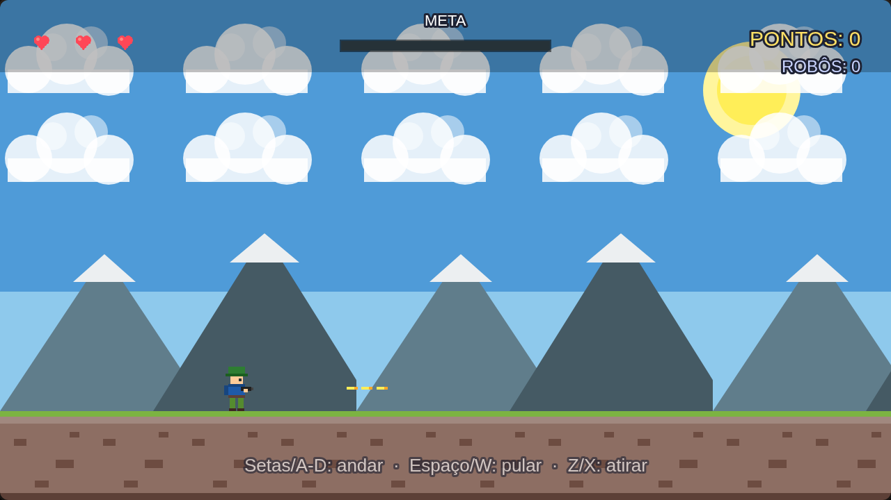

# Sargento Pixel — o segundo jogo: tiro em 2D (estilo Metal Slug) 🪖🎮

> **Trilha:** Meu Segundo Jogo (React + Phaser) · **Nível:** Básico+ · **Tempo:** ~4 aulas
> **Pré-requisito:** [Meu Primeiro Jogo — aulas 1 a 12](../02-PrimeiroJogo/README.md)

## 🎉 Do segundo jogo em diante, a tela anda!



> 📷 *Print do jogo de verdade: o sargento atirando, com o HUD no topo
> (corações, barra de progresso "META", pontos e robôs derrotados).*

No primeiro jogo a tela era fixa. Aqui o **mundo é gigante** (4600 pixels
de largura — mais de 3 telas!) e a **câmera anda junto com o herói**.
Esse truque se chama **scroll lateral**, e é o segredo dos jogos
**Metal Slug** e **Contra**! 🔄 Você vai controlar um sargento que anda,
pula e atira em robôs — e no fim do mapa um **CHEFÃO (tanque)** espera
por você. 🛢️💥

> 🎨 **A grande sacada desta aula:** não usamos **nenhuma imagem pronta**!
> Desenhamos **TUDO com código** (retângulos, círculos e triângulos),
> igual pixel art raiz. O jogo abre em qualquer lugar, sem baixar nada —
> e você aprende que sprite é só "um desenho que o computador guarda". 🖌️

---

## 🎯 O que você vai aprender

* Como funciona um jogo de **tiro e ação 2D** (run and gun);
* **Scroll lateral**: mundo gigante + câmera que segue o herói;
* **Desenhar com código**: `make.graphics` + `generateTexture` (sem assets!);
* O herói **atira**, os inimigos **atiram de volta** (IA simples!);
* Um **chefão** no fim do mapa, com barra de vida;
* **Vidas, HUD, game over e vitória** — o loop completo de um jogo;
* **Parallax** no cenário (céu, nuvens, montanhas em velocidades diferentes).

> 🧠 **O que é "run and gun"?** É o gênero de jogos de tiro em 2D onde o
> personagem **corre e atira** — Metal Slug, Contra, Gunstar Heroes...
> A tela anda sozinha (ou segue o herói) e a ação não para! 🏃‍♂️💨

---

## 🚀 Como rodar

**Sem instalar nada:** abra o arquivo `index.html` (dois cliques).
A pasta `lib/` já tem o Phaser — não precisa de internet.

**Com React:** `cd react && npm install && npm run dev`.

**Controles:**

| Tecla | Ação |
|---|---|
| ← → ou A/D | andar |
| ↑ ou ESPAÇO ou W | pular |
| Z ou X | atirar (segure!) |
| R | jogar de novo (quando o jogo acabar) |

**Objetivo completo:** atravesse o mundo, derrote os robôs que atiram
em você e destrua o **CHEFÃO** no fim do mapa. São **3 vidas** — se
acabar, aperte **R**!

---

## 🔍 O código explicado

O arquivo `src/scenes/Jogo.js` está dividido em **ETAPAS numeradas**
(procure "ETAPA" no código). Cada etapa é um conceito novo:

| Etapa | Tema |
|---|---|
| **0** | PRELOAD: "desenhar" as texturas com código |
| **1** | CREATE: montar o mundo (céu, chão, herói, câmera...) |
| **2** | TIRO: grupo de balas + cadência + flash |
| **3** | INIMIGOS: spawn (nascer), patrulha (andar) e IA de tiro |
| **4** | DANO: quando as balas acertam |
| **5** | O CHEFÃO: tanque no fim do mundo + barra de vida |
| **6** | EFEITOS: explosão de partículas (juice! 🍋) |
| **7** | HUD: vidas, pontos, barra de progresso e barra do chefão |
| **8** | GAME OVER e VITÓRIA |

### 1) Desenhar com código — o nosso pincel de pixel art 🎨

Em vez de carregar imagens, desenhamos com quadradinhos coloridos:

```js
function pintar(g, cor, x, y, largura, altura) {
    g.fillStyle(cor, 1);
    g.fillRect(x, y, largura, altura);
}
```

`g` é um `graphics` — uma "folha de papel em branco" (`add: false` =
não vira objeto do jogo, só desenho). Depois guardamos na memória:

```js
this.desenharHeroi() {
    const g = this.novoDesenho();
    pintar(g, '#2f9e44', 16, 0, 16, 8);    // boina do sargento
    pintar(g, '#f1c27d', 16, 8, 16, 14);   // rosto
    // ...vários quadradinhos depois, temos um soldadinho!
    g.generateTexture('heroi-parado', 48, 64);  // guarda com um apelido
}
```

`generateTexture('nome', largura, altura)` guarda o desenho na memória
do jogo com um **apelido** — depois é só usar `this.add.sprite(x, y,
'heroi-parado')`! 💾 É assim que se faz pixel art raiz: cada quadradinho
é um pixel grandão.

> ⚠️ **Detalhe de reinício:** quando o jogo reinicia (tecla R), o
> `create()` roda de novo. Se tentarmos desenhar as texturas de novo,
> `generateTexture` com apelido repetido dá aviso no console. Por isso
> a proteção no começo: `if (this.textures.exists('heroi-parado')) return;`

### 2) Scroll lateral — o mundo é uma fila gigante 🔄

```js
const TAMANHO_MUNDO = 4600;   // 4 telas e meia de largura!

this.physics.world.setBounds(0, 0, TAMANHO_MUNDO, ALTURA_TELA);
this.cameras.main.setBounds(0, 0, TAMANHO_MUNDO, ALTURA_TELA);
this.cameras.main.startFollow(this.jogador, true, 0.1, 0.05);
```

* `setBounds` = "o mundo termina aqui" — nada passa dos 4600 px.
* `startFollow(jogador, true, 0.1, 0.05)` = a câmera **segue** o herói,
  com uma **suavização** (os números são o quanto ela alcança por frame —
  quanto menor, mais "preguiçosa" e gostosa).

> 💡 O mundo é maior que a tela, mas desenhamos só o pedaço que a câmera
> enxerga. O resto é memória guardada! 🧠

### 3) Parallax — o cenário tem profundidade 🌄

```js
this.add.image(0, 0, 'ceu').setOrigin(0, 0).setScrollFactor(0);
// montanhas bem atrás, quase paradas:
montanha.setScrollFactor(0.35);
// chão e herói: scrollFactor 1 (padrão) — andam junto com a câmera
```

`setScrollFactor(n)` diz **quanto** o objeto anda junto com a câmera:
`0` = grudado na tela (HUD), `0.35` = anda devagar (longe),
`1` = anda normal (perto). É a ilusão de profundidade! 🏔️

### 4) Tiro com cadência — segurar não é travar 🔫

```js
atirar() {
    if (this.time.now < this.proximoTiro) return;   // ainda não pode!
    this.proximoTiro = this.time.now + CADENCIA_TIRO; // agenda o próximo

    const direcao = this.jogador.flipX ? -1 : 1;
    const bala = this.balas.create(this.jogador.x + direcao * 28,
                                  this.jogador.y - 33, 'bala');
    bala.body.setAllowGravity(false);   // bala não cai!
    bala.body.setVelocityX(direcao * VEL_BALA);
}
```

* `this.time.now` é o **relógio do jogo** (em milissegundos).
* `CADENCIA_TIRO = 180` = no máximo **1 tiro a cada 180 ms**, mesmo
  segurando Z — o jogo não vira uma metralhadora infinita! ⏱️
* As balas nascem dentro de um **grupo** (`this.balas`), que já sabe
  criar, reciclar e contar os membros. E fora da tela? `limparBalas()`
  destrói — o jogo não fica lento com bala perdida! 🧹

### 5) Inimigos que nascem, andam e atiram 🤖

```js
// nasce um robô a cada 2,2 segundos, FORA da tela, à direita:
this.timerSpawn = this.time.addEvent({
    delay: INTERVALO_SPAWN, loop: true, callback: () => this.tentarSpawnarInimigo()
});
```

A IA do robô é bem simples (e é o suficiente para divertir!):

1. **Patrulha:** anda sempre para a esquerda (vem em direção ao herói);
2. **Atira** quando o herói está perto (`DISTANCIA_TIRO_INIMIGO = 560`);
3. Se ficar para trás da tela, **some** (não gasta memória).

> 🧠 **IA** = Inteligência Artificial. Nem precisa ser esperta — precisa
> ser **justa**! Um robô que atira quando você está perto já parece vivo.

### 6) Dano — quem acertou, acertou! 💥

As colisões são registradas uma vez no `create()`:

```js
this.physics.add.overlap(this.balas, this.inimigos, this.balaAcertouInimigo, null, this);
this.physics.add.overlap(this.balas, this.balasInimigas, this.balasSeAnulam, null, this);
this.physics.add.overlap(this.balasInimigas, this.jogador, this.balaAcertouJogador, null, this);
this.physics.add.overlap(this.jogador, this.inimigos, this.contatoComInimigo, null, this);
```

* `collider` **barra** a passagem (herói não atravessa o chão);
* `overlap` só **avisa** quando encosta (dano, pontos...).

> 💡⚠️ **ARMADILHA DA ORDEM DOS ARGUMENTOS!** Quando o overlap é entre
> um **GRUPO e um SPRITE**, o Phaser chama o callback na ordem
> **(SPRITE, MEMBRO DO GRUPO)** — no chefão fica `(chefao, bala)`, não
> `(bala, chefao)`! Se inverter, o `bala.destroy()` destrói o tanque em
> vez da bala. 😱 Cada tipo de colisão tem sua ordem — teste e confira!

Depois de levar dano, o herói fica **invencível por 1,5 s** piscando —
senão um tiro só tiraria as 3 vidas de uma vez! ⏱️✨

### 7) O CHEFÃO — um tanque no fim do mundo 🛢️

Quando o herói chega perto do fim (`X_GATILHO_CHEFE`), o tanque entra
em cena com direito a tela tremendo e aviso piscando:

```js
this.chefao.body.setImmovable(true);      // o herói não empurra o tanque
this.chefao.body.setAllowGravity(false); // ⚠️ sem gravidade!
```

> ⚠️ **CUIDADO:** corpo IMÓVEL + gravidade = atravessa o chão! No motor
> Arcade, dois corpos "imóveis" não se resolvem (o chão é imóvel!) — o
> tanque cairia para sempre. Por isso o tanque não tem gravidade: ele
> fica "em pé" na altura do chão e anda só com a velocidade. O chefão
> tem **30 de vida** e uma **barra vermelha no topo** quando aparece.

### 8) Game over e vitória — o jogo tem começo, meio e fim 🏁

```js
// vitória (chefão destruído):
this.time.delayedCall(1400, () => this.vitoria());

// game over (vidas zeradas):
this.acabou = true;                                  // trava tudo
this.input.keyboard.on('keydown-R', () => {
    if (this.acabou || this.vitorioso) this.scene.restart();
});
```

* `this.acabou` / `this.vitorioso` são **flags**: no `update()`, se o jogo
  acabou, `return` imediato — ninguém se mexe. 🧊
* `this.scene.restart()` reinicia a cena inteira — simples e poderoso!

---

## 🧩 Palavras novas

| Palavra | Significado |
|---|---|
| **run and gun** | Gênero de tiro em 2D: corre, pula e atira (Metal Slug, Contra). |
| **scroll lateral** | A câmera anda para o lado acompanhando o herói; o mundo é gigante. |
| **scrollFactor** | Quanto um objeto anda junto com a câmera (0 = grudado, 1 = normal). |
| **generateTexture** | Guarda um desenho feito com `graphics` na memória, com um apelido. |
| **cadência** | O tempo mínimo entre um tiro e outro. |
| **spawn** | "Nascer": criar um inimigo durante o jogo. |
| **IA** | Inteligência Artificial — o "cérebro" simples dos inimigos. |
| **chefão (boss)** | O inimigo grandão do fim da fase. |
| **imóvel (immovable)** | Um corpo que outros corpos não conseguem empurrar. |
| **invencibilidade** | Um tempo em que o herói não pode levar dano de novo. |

---

## 🎯 Tarefas finais (agora você é o(a) game designer!)

1. Deixe o jogo mais fácil: `VIDA_CHEFE = 10` e `VIDAS_INICIAIS = 5`.
2. Deixe o jogo mais difícil: `CADENCIA_TIRO = 350` (tiro mais lento) e
   `INTERVALO_SPAWN = 1200` (nasce robô toda hora).
3. **Novo inimigo:** desenhe um robô que pula (`FORCA_PULO` no `update`)
   usando `pintar()` — o seu primeiro sprite original! 🎨
4. **Recorde:** salve a maior pontuação em `localStorage` e mostre no HUD.
5. **Munição:** faça o herói ter só 6 balas — quando acabar, precisa
   esperar 1 segundo para "recarregar". (Dica: um contador + `delayedCall`.)
6. **Personalize!** Troque as cores do tanque, desenhe um segundo chefão,
   mude o céu para noite. O jogo é seu. 🌙

---

## ❓ Problemas comuns

| Sintoma | Solução |
|---|---|
| `setVelocityX is not a function` | O objeto foi criado com `add.sprite` + `physics.add.existing` — ele **não tem** `setVelocityX`. Use `objeto.body.setVelocityX(...)`. |
| Erro `Cannot read properties of undefined (reading 'isParent')` no 1º frame | Você criou as plataformas **antes** do herói — o `collider` recebeu `undefined`. Crie o herói antes de qualquer coisa que colide com ele! |
| O chefão cai através do chão | `setImmovable(true)` **com gravidade**: dois corpos imóveis não se resolvem no Arcade. Tire a gravidade: `body.setAllowGravity(false)`. |
| A bala do herói destrói o chefão (ou o jogo parece "quebrado") | A ordem dos argumentos do callback de grupo×sprite é **(sprite, membro)**: `balaAcertouChefao(chefao, bala)`. |
| Aviso de textura repetida no console ao reiniciar | Proteja o desenho: `if (this.textures.exists('heroi-parado')) return;`. |
| O HUD some quando a câmera anda | Faltou `setScrollFactor(0)` nos objetos do HUD. |
| O jogo fica lento depois de jogar um tempo | Faltou limpar as balas que saem da tela (`limparBalas()`). |
| O herói continua andando depois do game over | Falta o `if (this.acabou \|\| this.vitorioso) return;` no começo do `update()`. |

---

## ✅ Checklist final

- [ ] Meu jogo tem scroll lateral (a câmera segue o herói).
- [ ] O herói atira e os inimigos atiram de volta.
- [ ] Existe um chefão no fim do mapa, com barra de vida.
- [ ] Tem HUD com vidas, pontos e progresso.
- [ ] Perder todas as vidas dá game over; destruir o chefão dá vitória.
- [ ] Dá para jogar de novo apertando R.
- [ ] Consigo explicar o que é `generateTexture` e `scrollFactor`. 🎨
- [ ] Personalizei o jogo do meu jeito. 🪖

## 🏆 Parabéns!

Você fez um **jogo de tiro de ação completo** — com scroll lateral,
tiro dos dois lados, chefão, vidas, HUD, game over e vitória. Isso é o
mesmo esqueleto dos clássicos **Metal Slug** e **Contra**! 🪖🎉

**Para onde ir agora** (ainda no repositório React-Phaser):

| Quero... | Vá para |
|---|---|
| Mais cenários e parallax avançado | `02-Scripts/03-Cenarios` |
| Gravidade, atrito, molas, veículos | `02-Scripts/04-Fisica` |
| HUDs de RPG, corrida, luta... | `02-Scripts/05-HUD` |
| Efeitos visuais e partículas | `06-VFX` |
| Músicas e sons | `07-Sounds` |
| Jogos completos para estudar | `03-Jogos` e `04-Sprites` |
| Planejar o SEU jogo | `09-gdd` (Game Design Document) |

---

⬅️ **Trilha anterior:** [Meu Primeiro Jogo — aulas 1 a 12](../02-PrimeiroJogo/README.md)
